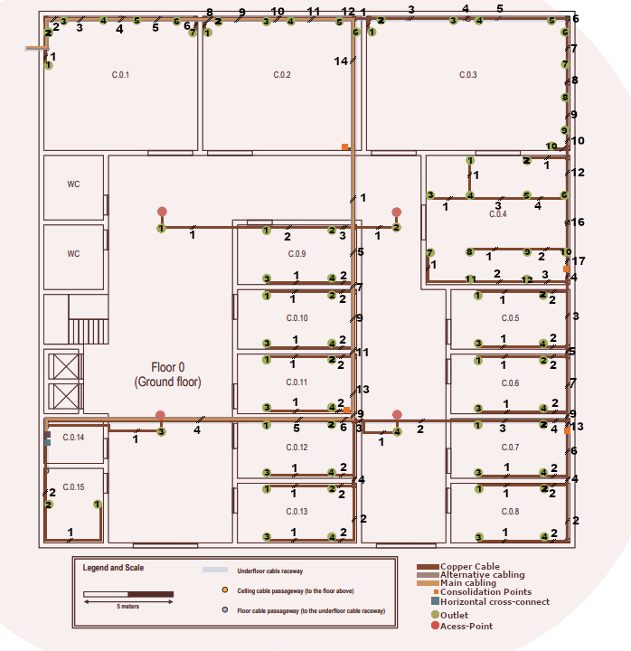
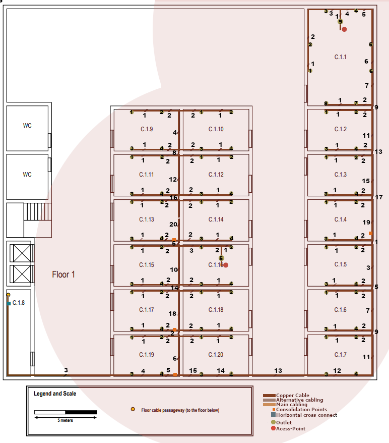

RCOMP 2022-2023 Project - Sprint 1 - Member 1211089 folder
===========================================

# Floor 0 

### *Floor 0 image*

# Floor 0 technical info

|  Room  | Length (m) | Width (m) | Area (m2) |
|:------:|:----------:|:---------:|:---------------------|
| C.0.1  |    8.48    |   7.42    | 62.92                |
| C.0.2  |    8.73    |   7.42    | 64.77                |
| C.0.3  |   11.26    |   7.42    | 83.55                |
| C.0.4  |    7.93    |   7.12    | 56.46                |
| C.0.5  |    6.57    |   3.23    | 62.92                |
| C.0.6  |    6.57    |   3.23    | 62.92                |
| C.0.7  |    6.57    |   3.23    | 62.92                |
| C.0.8  |    6.57    |   3.23    | 62.92                |
| C.0.9  |    6.57    |   3.23    | 62.92                |
| C.0.10 |    6.57    |   3.23    | 62.92                |
| C.0.11 |    6.57    |   3.23    | 62.92                |
| C.0.12 |    6.57    |   3.23    | 62.92                |
| C.0.13 |    6.57    |   3.23    | 62.92                |
| C.0.14 |    2.24    |   3.28    | 7.34                 |
| C.0.15 |    4.09    |   3.23    | 13.21                |

### Floor 0 - Fiber Cables

* For the connection of Intermediate Cross-Connect(IC) to Horizontal Cross-Connect(HC) we choose Monomode optical fibre
  because it´s immune/less susceptible to dispersion and thus allows higher data rates.   

### Floor 0 - Cooper Cables

* To connect the Horizontal Cross-Connect(HC) to all Outlets we use Copper Cables CAT7.    
* We chose this cable type they can support faster data transfer rates (10 Gbps) and more simultaneous connections, which
  is important for modern applications.   
* Copper Cables CAT7 are generally more cost-effective than fiber optic cables.   
* Copper Cables CAT7 are compatible with a wide range of network devices.(end-user equipment is not usually prepared for fiber optic cables)   

### Floor 0 - Outlet

* The number of outlets we can place in a room was calculated using the areas previously mentioned.   
* The structured cabling standards say that for each 10m2, we should have at least 2 outlets.  
* There was some care to avoid placing equipment too close to doors to avoid damage.  
* Some areas have more than 2 outlets per 10m2 to provide flexibility for user, for this to happen we make sure that outlets always be
  less than 3m away from others outlets. 

### Floor 0 - Consolidation Point

* For this floor there will be 4 Consolidation Point.  
* 1st on Room C.0.11 that will host outlets of rooms -> C.0.9 to C.0.13
* 2nd on Room C.0.7 that will host outlets of rooms -> C.0.5 to C.0.8
* 3rd on Room C.0.2 that will host outlets of rooms -> C.0.1 to C.0.2
* 4th on Room C.0.4 that will host outlets of rooms -> C.0.3 to C.0.4
* This Consolidation are placed in this local's because this floor will have 73 Outlets, so using this Consolidation Points
  we can avoid to use a Patch Panel of 48 female connectors and can have a better organization on our structured cabling.

### Floor 0 - Access Point

* We choose to place 4 Access Point to this at the top of the main corridor at four different locations  
* Usually an Access Point will grant approximate a 50 meters diameter circle of coverage, but this is relative to an empty area.
  But in a Building like our we have walls that will interfere. So we only are considering a coverage of 30 meters.  
* We choose to place this Access Point on this local because it's near of all rooms and have less interference from walls
  than if it was placed inside a room.  

### Floor 0 - Horizontal Cross Connect

* The Horizontal cross-connect (HC) was placed in the room C.0.14 because this room it's a storage room and also contains the passageway to the floor above
  and provides easy access to the other rooms on that floor.  

# Floor 0 inventory

### Floor 0 Inventory - Fiber Cables
| Designation                                                 | Quantity (m) |
|-------------------------------------------------------------|:------------:|
| Main Monomode optical fibre cable (Outside to MC)           |      60      |
| Main Monomode optical fibre cable (IC to HC Floor 1)        |      6       |
| Alternative Monomode optical fibre cable (Outside to MC)    |      60      |
| Alternative Monomode optical fibre cable (IC to HC Floor 1) |      5       |
| Sum Monomode optical fibre cable:                           |     131      |
| Total Monomode optical fibre cable:                         |     262      |

(+)The presented value for Monomode optical fibre cable length present a margin of error.
(+)All Monomode optical fibre cable are included in this inventory
(+)The presented on "Total Monomode optical fibre cable" is the value presented on "Sum Monomode optical fibre cable"
multiplied by 2 because each path have 2 cables.

### Floor 0 Inventory - Copper Cables
| Designation                                                                     | Quantity (m) |
|---------------------------------------------------------------------------------|:------------:|
| Copper Cable  CAT7 (IC to Consolidation Point in Room C.0.11)                   |      19      |
| Copper Cable  CAT7 (IC to Consolidation Point in Room C.0.7)                    |      39      |
| Copper Cable  CAT7 (IC to Consolidation Point in Room C.0.4)                    |      32      |
| Copper Cable  CAT7 (IC to Consolidation Point in Room C.0.2)                    |      31      |
| Copper Cable  CAT7 (IC to Outlet 3 in the corridor)                             |     7.4      |
| Copper Cable  CAT7 (IC to room C.0.15 outlet 2)                                 |     3.8      |
| Copper Cable  CAT7 (IC to room C.0.15 outlet 1)                                 |     10.1     |
| Copper Cable  CAT7 (CP in Room C.0.11 to Outlet 1 in room C.0.13)               |     9.2      |
| Copper Cable  CAT7 (CP in Room C.0.11 to Outlet 2 in room C.0.13)               |     5.6      |
| Copper Cable  CAT7 (CP in Room C.0.11 to Outlet 3 in room C.0.13)               |     11.9     |
| Copper Cable  CAT7 (CP in Room C.0.11 to Outlet 4 in room C.0.13)               |     8.3      |
| Copper Cable  CAT7 (CP in Room C.0.11 to Outlet 1 in room C.0.12)               |     5.6      |
| Copper Cable  CAT7 (CP in Room C.0.11 to Outlet 2 in room C.0.12)               |      2       |
| Copper Cable  CAT7 (CP in Room C.0.11 to Outlet 3 in room C.0.12)               |     8.3      |
| Copper Cable  CAT7 (CP in Room C.0.11 to Outlet 4 in room C.0.12)               |     4.7      |
| Copper Cable  CAT7 (CP in Room C.0.11 to Outlet 1 in room C.0.11)               |     7.8      |
| Copper Cable  CAT7 (CP in Room C.0.11 to Outlet 2 in room C.0.11)               |     4.2      |
| Copper Cable  CAT7 (CP in Room C.0.11 to Outlet 3 in room C.0.11)               |     5.1      |
| Copper Cable  CAT7 (CP in Room C.0.11 to Outlet 4 in room C.0.11)               |     1.4      |
| Copper Cable  CAT7 (CP in Room C.0.11 to Outlet 1 in room C.0.10)               |     11.4     |
| Copper Cable  CAT7 (CP in Room C.0.11 to Outlet 2 in room C.0.10)               |     7.8      |
| Copper Cable  CAT7 (CP in Room C.0.11 to Outlet 3 in room C.0.10)               |      9       |
| Copper Cable  CAT7 (CP in Room C.0.11 to Outlet 4 in room C.0.10)               |      5       |
| Copper Cable  CAT7 (CP in Room C.0.11 to Outlet 1 in room C.0.9)                |      15      |
| Copper Cable  CAT7 (CP in Room C.0.11 to Outlet 2 in room C.0.9)                |     11.3     |
| Copper Cable  CAT7 (CP in Room C.0.11 to Outlet 3 in room C.0.9)                |     12.3     |
| Copper Cable  CAT7 (CP in Room C.0.11 to Outlet 4 in room C.0.9)                |     8.7      |
| Copper Cable  CAT7 (CP in Room C.0.11 to Outlet 1 in the corridor)              |      20      |
| Copper Cable  CAT7 (CP in Room C.0.11 to Outlet 2 in the corridor)              |      18      |
| Copper Cable  CAT7 (CP in Room C.0.11 to Outlet 4 in the corridor)              |      10      |
| Copper Cable  CAT7 (CP in Room C.0.7 to Outlet 1 in room C.0.7)                 |     5.8      |
| Copper Cable  CAT7 (CP in Room C.0.7 to Outlet 2 in room C.0.7)                 |      2       |
| Copper Cable  CAT7 (CP in Room C.0.7 to Outlet 3 in room C.0.7)                 |     7.4      |
| Copper Cable  CAT7 (CP in Room C.0.7 to Outlet 4 in room C.0.7)                 |     4.1      |
| Copper Cable  CAT7 (CP in Room C.0.7 to Outlet 1 in room C.0.6)                 |     9.2      |
| Copper Cable  CAT7 (CP in Room C.0.7 to Outlet 2 in room C.0.6)                 |     5.6      |
| Copper Cable  CAT7 (CP in Room C.0.7 to Outlet 3 in room C.0.6)                 |     6.4      |
| Copper Cable  CAT7 (CP in Room C.0.7 to Outlet 4 in room C.0.6)                 |      3       |
| Copper Cable  CAT7 (CP in Room C.0.7 to Outlet 1 in room C.0.5)                 |     12.8     |
| Copper Cable  CAT7 (CP in Room C.0.7 to Outlet 2 in room C.0.5)                 |     9.2      |
| Copper Cable  CAT7 (CP in Room C.0.7 to Outlet 3 in room C.0.5)                 |     10.1     |
| Copper Cable  CAT7 (CP in Room C.0.7 to Outlet 4 in room C.0.5)                 |     6.5      |
| Copper Cable  CAT7 (CP in Room C.0.7 to Outlet 1 in room C.0.8)                 |      9       |
| Copper Cable  CAT7 (CP in Room C.0.7 to Outlet 2 in room C.0.8)                 |      5       |
| Copper Cable  CAT7 (CP in Room C.0.7 to Outlet 3 in room C.0.8)                 |     11.2     |
| Copper Cable  CAT7 (CP in Room C.0.7 to Outlet 4 in room C.0.8)                 |     7.4      |
| Copper Cable  CAT7 (CP in Room C.0.4 to Outlet 1 in room C.0.4)                 |     12.3     |
| Copper Cable  CAT7 (CP in Room C.0.4 to Outlet 2 in room C.0.4)                 |     8.7      |
| Copper Cable  CAT7 (CP in Room C.0.4 to Outlet 3 in room C.0.4)                 |      12      |
| Copper Cable  CAT7 (CP in Room C.0.4 to Outlet 4 in room C.0.4)                 |      10      |
| Copper Cable  CAT7 (CP in Room C.0.4 to Outlet 5 in room C.0.4)                 |     6.5      |
| Copper Cable  CAT7 (CP in Room C.0.4 to Outlet 6 in room C.0.4)                 |     4.2      |
| Copper Cable  CAT7 (CP in Room C.0.4 to Outlet 7 in room C.0.4)                 |     9.5      |
| Copper Cable  CAT7 (CP in Room C.0.4 to Outlet 8 in room C.0.4)                 |     5.8      |
| Copper Cable  CAT7 (CP in Room C.0.4 to Outlet 9 in room C.0.4)                 |      3       |
| Copper Cable  CAT7 (CP in Room C.0.4 to Outlet 10 in room C.0.4)                |      1       |
| Copper Cable  CAT7 (CP in Room C.0.4 to Outlet 11 in room C.0.4)                |     5.9      |
| Copper Cable  CAT7 (CP in Room C.0.4 to Outlet 12 in room C.0.4)                |      3       |
| Copper Cable  CAT7 (CP in Room C.0.4 to Outlet 1 in room C.0.3)                 |     25.9     |
| Copper Cable  CAT7 (CP in Room C.0.4 to Outlet 2 in room C.0.3)                 |      25      |
| Copper Cable  CAT7 (CP in Room C.0.4 to Outlet 3 in room C.0.3)                 |     20.9     |
| Copper Cable  CAT7 (CP in Room C.0.4 to Outlet 4 in room C.0.3)                 |     19.5     |
| Copper Cable  CAT7 (CP in Room C.0.4 to Outlet 5 in room C.0.3)                 |     15.4     |
| Copper Cable  CAT7 (CP in Room C.0.4 to Outlet 6 in room C.0.3)                 |      14      |
| Copper Cable  CAT7 (CP in Room C.0.4 to Outlet 7 in room C.0.3)                 |      12      |
| Copper Cable  CAT7 (CP in Room C.0.4 to Outlet 8 in room C.0.3)                 |      10      |
| Copper Cable  CAT7 (CP in Room C.0.4 to Outlet 9 in room C.0.3)                 |      8       |
| Copper Cable  CAT7 (CP in Room C.0.4 to Outlet 10 in room C.0.3)                |      8       |
| Copper Cable  CAT7 (CP in Room C.0.2 to Outlet 1 in room C.0.1)                 |     25.5     |
| Copper Cable  CAT7 (CP in Room C.0.2 to Outlet 2 in room C.0.1)                 |     24.5     |
| Copper Cable  CAT7 (CP in Room C.0.2 to Outlet 2 in room C.0.1 (Second Outlet)) |     24.5     |
| Copper Cable  CAT7 (CP in Room C.0.2 to Outlet 3 in room C.0.1)                 |     22.8     |
| Copper Cable  CAT7 (CP in Room C.0.2 to Outlet 4 in room C.0.1)                 |      21      |
| Copper Cable  CAT7 (CP in Room C.0.2 to Outlet 5 in room C.0.1)                 |     19.5     |
| Copper Cable  CAT7 (CP in Room C.0.2 to Outlet 6 in room C.0.1)                 |     17.2     |
| Copper Cable  CAT7 (CP in Room C.0.2 to Outlet 7 in room C.0.1)                 |     16.5     |
| Copper Cable  CAT7 (CP in Room C.0.2 to Outlet 1 in room C.0.2)                 |     15.9     |
| Copper Cable  CAT7 (CP in Room C.0.2 to Outlet 2 in room C.0.2)                 |     15.4     |
| Copper Cable  CAT7 (CP in Room C.0.2 to Outlet 3 in room C.0.2)                 |     13.1     |
| Copper Cable  CAT7 (CP in Room C.0.2 to Outlet 4 in room C.0.2)                 |     11.6     |
| Copper Cable  CAT7 (CP in Room C.0.2 to Outlet 5 in room C.0.2)                 |     8.6      |
| Copper Cable  CAT7 (CP in Room C.0.2 to Outlet 6 in room C.0.2)                 |     6.7      |
| Total Copper Cables CAT7 :                                                      |     895      |

(+)The presented value for Copper Cables CAT7 length present a margin of error.

### Floor 0 - Cooper Cables

* To connect the Horizontal Cross-Connect(HC) to all Outlets we use Copper Cables CAT7.    
* We chose this cable type they can support faster data transfer rates (10 Gbps) and more simultaneous connections, which
  is important for modern applications.   
* Copper Cables CAT7 are generally more cost-effective than fiber optic cables.   
* Copper Cables CAT7 are compatible with a wide range of network devices.(end-user equipment is not usually prepared for fiber optic cables)   

### Floor 0 - Outlet

* The number of outlets we can place in a room was calculated using the areas previously mentioned.   
* The structured cabling standards say that for each 10m2, we should have at least 2 outlets.  
* There was some care to avoid placing equipment too close to doors to avoid damage.  
* Some areas have more than 2 outlets per 10m2 to provide flexibility for user, for this to happen we make sure that outlets always be
  less than 3m away from others outlets. 

### Floor 0 - Consolidation Point

* For this floor there will be 4 Consolidation Point.  
* 1st on Room C.0.11 that will host outlets of rooms -> C.0.9 to C.0.13
* 2nd on Room C.0.7 that will host outlets of rooms -> C.0.5 to C.0.8
* 3rd on Room C.0.2 that will host outlets of rooms -> C.0.1 to C.0.2
* 4th on Room C.0.4 that will host outlets of rooms -> C.0.3 to C.0.4
* This Consolidation are placed in this local's because this floor will have 75 Outlets, so using this Consolidation Points
  we can avoid to use a Patch Panel of 48 female connectors and can have a better organization on our structured cabling.

### Floor 0 - Access Point

* We choose to place 4 Access Point to this at the top of the main corridor at four different locations  
* Usually an Access Point will grant approximate a 50 meters diameter circle of coverage, but this is relative to an empty area.
  But in a Building like our we have walls that will interfere. So we only are considering a coverage of 30 meters.  
* We choose to place this Access Point on this local because it's near of all rooms and have less interference from walls
  than if it was placed inside a room.  

### Floor 0 - Horizontal Cross Connect

* The Horizontal cross-connect (HC) was placed in the room C.0.14 because this room it's a storage room and also contains the passageway to the floor above
  and provides easy access to the other rooms on that floor.  

### Floor 0 Inventory - Intermediate Cross Connect
| Designation              | Quantity |
|--------------------------|:--------:|
| Fiber Patch Panel 24port |    1     |
| Fiber Patch Cords        |    2     |
| Rack 6U                  |    1     |

### Floor 0 Inventory - Horizontal Cross Connect
| Designation             | Quantity |
|-------------------------|:--------:|
| Switch 24 port          |    1     |
| Cat7 Patch Panel 24port |    1     |
| Cat7 Patch Cords        |    17    |
| Rack 6U                 |    1     |
| Access Point            |    1     |
| Network Outlets         |    17    |

### Floor 0 Inventory - Consolidation Point Room C.0.11
| Designation             | Quantity |
|-------------------------|:--------:|
| Switch 24port           |    1     |
| Cat7 Patch Panel 24port |    1     |
| Cat7 Patch Cords        |    24    |
| Rack 3U                 |    1     |
| Access Point            |    3     |
| Network Outlets         |    23    |

### Floor 0 Inventory - Consolidation Point Room C.0.7
| Designation             | Quantity |
|-------------------------|:--------:|
| Switch 24port           |    1     |
| Cat7 Patch Panel 24port |    1     |
| Cat7 Patch Cords        |    16    |
| Rack 3U                 |    1     |
| Network Outlets         |    16    |

### Floor 0 Inventory - Consolidation Point Room C.0.4
| Designation                    | Quantity |
|--------------------------------|:--------:|
| Switch 24port                  |    1     |
| Cat7 Patch Panel 24port        |    1     |
| Cat7 Patch Cords  (16 Outlets) |    22    |
| Rack 3U                        |    1     |
| Network Outlets                |    22    |

### Floor 0 Inventory - Consolidation Point Room C.0.2
| Designation                    | Quantity |
|--------------------------------|:--------:|
| Switch 24port                  |    1     |
| Cat7 Patch Panel 24port        |    1     |
| Cat7 Patch Cords  (16 Outlets) |    15    |
| Rack 3U                        |    1     |
| Network Outlets                |    15    |

# Floor 1

### *Floor 1 image*

# Floor 1 technical info

|  Room  | Length (m) | Width (m) | Area (m2) |
|:------:|:----------:|:---------:|:---------------------|
| C.1.1  |    7.74    |   5.24    | 40.56                |
| C.1.2  |    5.24    |   3.29    | 17.24                |
| C.1.3  |    5.24    |   3.29    | 17.24                |
| C.1.4  |    5.24    |   3.29    | 17.24                |
| C.1.5  |    5.24    |   3.29    | 17.24                |
| C.1.6  |    5.24    |   3.29    | 17.24                |
| C.1.7  |    5.24    |   3.29    | 17.24                |
| C.1.8  |    5.24    |   3.29    | 17.24                |
| C.1.9  |    5.24    |   3.29    | 17.24                |
| C.1.10 |    5.24    |   3.29    | 17.24                |
| C.1.11 |    5.24    |   3.29    | 17.24                |
| C.1.12 |    5.24    |   3.29    | 17.24                |
| C.1.13 |    5.24    |   3.29    | 17.24                |
| C.1.14 |    5.24    |   3.29    | 17.24                |
| C.1.15 |    5.24    |   3.29    | 17.24                |
| C.1.16 |    5.24    |   3.29    | 17.24                |
| C.1.17 |    5.24    |   3.29    | 17.24                |
| C.1.18 |    5.24    |   3.29    | 17.24                |
| C.1.19 |    5.24    |   3.29    | 17.24                |
| C.1.20 |    5.24    |   3.29    | 17.24                |

### Floor 1 - Cooper Cables

* To connect the Horizontal Cross-Connect(HC) to all Outlets we use Copper Cables CAT7.    
* We chose this cable type they can support faster data transfer rates (10 Gbps) and more simultaneous connections, which
  is important for modern applications.   
* Copper Cables CAT7 are generally more cost-effective than fiber optic cables.   
* Copper Cables CAT7 are compatible with a wide range of network devices.(end-user equipment is not usually prepared for fiber optic cables)   

### Floor 1 - Outlet

* The number of outlets we can place in a room was calculated using the areas previously mentioned.   
* The structured cabling standards say that for each 10m2, we should have at least 2 outlets.  
* There was some care to avoid placing equipment too close to doors to avoid damage.  
* Some areas have more than 2 outlets per 10m2 to provide flexibility for user, for this to happen we make sure that outlets always be
  less than 3m away from others outlets. 

### Floor 1 - Consolidation Point

* For this floor there will be 4 Consolidation Point.  
* 1st on Room C.1.13 that will host outlets of rooms -> C.1.9 to C.1.13
* 2nd on Room C.1.17 that will host outlets of rooms -> C.1.14 to C.1.18
* 3rd on Room C.1.19 that will host outlets of rooms -> C.1.19 to C.1.20 and C.1.5 to C.1.7
* 4th on Room C.1.4 that will host outlets of rooms -> C.1.1 to C.1.4
* This Consolidation are placed in this local's because this floor will have 80 Outlets, so using this Consolidation Points
  we can avoid to use a Patch Panel of 48 female connectors and can have a better organization on our structured cabling.

### Floor 1 - Access Point

* We choose to place 2 Access Point, one inside the room C.1.16 and another one in the room C.1.4  
* Usually an Access Point will grant approximate a 50 meters diameter circle of coverage, but this is relative to an empty area.
  But in a Building like our we have walls that will interfere. So we only are considering a coverage of 30 meters.  
* We choose to place this Access Point on this local because it's near of all rooms and have less interference from walls
  than if it was placed inside a room.  

### Floor 1 - Horizontal Cross Connect

* The Horizontal cross-connect (HC) was placed in the room C.1.8 because this room it's a storage room and also contains the passageway to the floor below

# Floor 1 inventory

### Floor 0 Inventory - Copper Cables
| Designation                                                       | Quantity (m) |
|-------------------------------------------------------------------|:------------:|
| Copper Cable  CAT7 (HC to Consolidation Point in Room C.1.19)     |      19      |
| Copper Cable  CAT7 (HC to Consolidation Point in Room C.1.13)     |      30      |
| Copper Cable  CAT7 (HC to Consolidation Point in Room C.1.17)     |      23      |
| Copper Cable  CAT7 (HC to Consolidation Point in Room C.1.4)      |      46      |
| Copper Cable  CAT7 (CP in room C.1.13 to Outlet 1 in room C.1.9)  |     13.8     |
| Copper Cable  CAT7 (CP in room C.1.13 to Outlet 2 in room C.1.9)  |     11.2     |
| Copper Cable  CAT7 (CP in room C.1.13 to Outlet 3 in room C.1.9)  |     11.6     |
| Copper Cable  CAT7 (CP in room C.1.13 to Outlet 4 in room C.1.9)  |      9       |
| Copper Cable  CAT7 (CP in room C.1.13 to Outlet 1 in room C.1.10) |     11.6     |
| Copper Cable  CAT7 (CP in room C.1.13 to Outlet 2 in room C.1.10) |     14.2     |
| Copper Cable  CAT7 (CP in room C.1.13 to Outlet 3 in room C.1.10) |      9       |
| Copper Cable  CAT7 (CP in room C.1.13 to Outlet 4 in room C.1.10) |     11.6     |
| Copper Cable  CAT7 (CP in room C.1.13 to Outlet 1 in room C.1.11) |     10.2     |
| Copper Cable  CAT7 (CP in room C.1.13 to Outlet 2 in room C.1.11) |     7.6      |
| Copper Cable  CAT7 (CP in room C.1.13 to Outlet 3 in room C.1.11) |     7.5      |
| Copper Cable  CAT7 (CP in room C.1.13 to Outlet 4 in room C.1.11) |      5       |
| Copper Cable  CAT7 (CP in room C.1.13 to Outlet 1 in room C.1.12) |     8.5      |
| Copper Cable  CAT7 (CP in room C.1.13 to Outlet 2 in room C.1.12) |     10.8     |
| Copper Cable  CAT7 (CP in room C.1.13 to Outlet 3 in room C.1.12) |     5.9      |
| Copper Cable  CAT7 (CP in room C.1.13 to Outlet 4 in room C.1.12) |      8       |
| Copper Cable  CAT7 (CP in room C.1.13 to Outlet 1 in room C.1.13) |     6.8      |
| Copper Cable  CAT7 (CP in room C.1.13 to Outlet 2 in room C.1.13) |      4       |
| Copper Cable  CAT7 (CP in room C.1.13 to Outlet 3 in room C.1.13) |      4       |
| Copper Cable  CAT7 (CP in room C.1.13 to Outlet 4 in room C.1.13) |     1.5      |
| Copper Cable  CAT7 (CP in room C.1.17 to Outlet 1 in room C.1.14) |      12      |
| Copper Cable  CAT7 (CP in room C.1.17 to Outlet 2 in room C.1.14) |     14.2     |
| Copper Cable  CAT7 (CP in room C.1.17 to Outlet 3 in room C.1.14) |     9.4      |
| Copper Cable  CAT7 (CP in room C.1.17 to Outlet 4 in room C.1.14) |     11.6     |
| Copper Cable  CAT7 (CP in room C.1.17 to Outlet 1 in room C.1.15) |     9.8      |
| Copper Cable  CAT7 (CP in room C.1.17 to Outlet 2 in room C.1.15) |     7.6      |
| Copper Cable  CAT7 (CP in room C.1.17 to Outlet 3 in room C.1.15) |     7.2      |
| Copper Cable  CAT7 (CP in room C.1.17 to Outlet 4 in room C.1.15) |      5       |
| Copper Cable  CAT7 (CP in room C.1.17 to Outlet 1 in room C.1.16) |     8.9      |
| Copper Cable  CAT7 (CP in room C.1.17 to Outlet 2 in room C.1.16) |     11.6     |
| Copper Cable  CAT7 (CP in room C.1.17 to Outlet 3 in room C.1.16) |     5.9      |
| Copper Cable  CAT7 (CP in room C.1.17 to Outlet 4 in room C.1.16) |     8.5      |
| Copper Cable  CAT7 (CP in room C.1.17 to Outlet 5 in room C.1.16) |      14      |
| Copper Cable  CAT7 (CP in room C.1.17 to Outlet 1 in room C.1.17) |     6.8      |
| Copper Cable  CAT7 (CP in room C.1.17 to Outlet 2 in room C.1.17) |     4.2      |
| Copper Cable  CAT7 (CP in room C.1.17 to Outlet 3 in room C.1.17) |      4       |
| Copper Cable  CAT7 (CP in room C.1.17 to Outlet 4 in room C.1.17) |     1.5      |
| Copper Cable  CAT7 (CP in room C.1.17 to Outlet 1 in room C.1.18) |      5       |
| Copper Cable  CAT7 (CP in room C.1.17 to Outlet 2 in room C.1.18) |     7.6      |
| Copper Cable  CAT7 (CP in room C.1.17 to Outlet 3 in room C.1.18) |     2.4      |
| Copper Cable  CAT7 (CP in room C.1.17 to Outlet 4 in room C.1.18) |      5       |
| Copper Cable  CAT7 (CP in room C.1.19 to Outlet 1 in room C.1.19) |     6.8      |
| Copper Cable  CAT7 (CP in room C.1.19 to Outlet 2 in room C.1.19) |      4       |
| Copper Cable  CAT7 (CP in room C.1.19 to Outlet 3 in room C.1.19) |      4       |
| Copper Cable  CAT7 (CP in room C.1.19 to Outlet 4 in room C.1.19) |     1.5      |
| Copper Cable  CAT7 (CP in room C.1.19 to Outlet 1 in room C.1.20) |      5       |
| Copper Cable  CAT7 (CP in room C.1.19 to Outlet 2 in room C.1.20) |     7.6      |
| Copper Cable  CAT7 (CP in room C.1.19 to Outlet 3 in room C.1.20) |     2.4      |
| Copper Cable  CAT7 (CP in room C.1.19 to Outlet 4 in room C.1.20) |     4.6      |
| Copper Cable  CAT7 (CP in room C.1.19 to Outlet 1 in room C.1.7)  |     20.8     |
| Copper Cable  CAT7 (CP in room C.1.19 to Outlet 2 in room C.1.7)  |     18.2     |
| Copper Cable  CAT7 (CP in room C.1.19 to Outlet 3 in room C.1.7)  |     11.2     |
| Copper Cable  CAT7 (CP in room C.1.19 to Outlet 4 in room C.1.7)  |     13.4     |
| Copper Cable  CAT7 (CP in room C.1.19 to Outlet 1 in room C.1.6)  |     23.7     |
| Copper Cable  CAT7 (CP in room C.1.19 to Outlet 2 in room C.1.6)  |     21.6     |
| Copper Cable  CAT7 (CP in room C.1.19 to Outlet 3 in room C.1.6)  |     21.7     |
| Copper Cable  CAT7 (CP in room C.1.19 to Outlet 4 in room C.1.6)  |      19      |
| Copper Cable  CAT7 (CP in room C.1.19 to Outlet 1 in room C.1.5)  |     26.5     |
| Copper Cable  CAT7 (CP in room C.1.19 to Outlet 2 in room C.1.5)  |     24.8     |
| Copper Cable  CAT7 (CP in room C.1.19 to Outlet 3 in room C.1.5)  |     24.8     |
| Copper Cable  CAT7 (CP in room C.1.19 to Outlet 4 in room C.1.5)  |     22.6     |
| Copper Cable  CAT7 (CP in room C.1.4 to Outlet 1 in room C.1.4)   |      5       |
| Copper Cable  CAT7 (CP in room C.1.4 to Outlet 2 in room C.1.4)   |     3.6      |
| Copper Cable  CAT7 (CP in room C.1.4 to Outlet 3 in room C.1.4)   |     3.1      |
| Copper Cable  CAT7 (CP in room C.1.4 to Outlet 4 in room C.1.4)   |     1.5      |
| Copper Cable  CAT7 (CP in room C.1.4 to Outlet 1 in room C.1.3)   |      9       |
| Copper Cable  CAT7 (CP in room C.1.4 to Outlet 2 in room C.1.3)   |     7.2      |
| Copper Cable  CAT7 (CP in room C.1.4 to Outlet 3 in room C.1.3)   |     4.8      |
| Copper Cable  CAT7 (CP in room C.1.4 to Outlet 4 in room C.1.3)   |     4.6      |
| Copper Cable  CAT7 (CP in room C.1.4 to Outlet 1 in room C.1.2)   |     12.2     |
| Copper Cable  CAT7 (CP in room C.1.4 to Outlet 2 in room C.1.2)   |     10.6     |
| Copper Cable  CAT7 (CP in room C.1.4 to Outlet 3 in room C.1.2)   |     10.2     |
| Copper Cable  CAT7 (CP in room C.1.4 to Outlet 4 in room C.1.2)   |      8       |
| Copper Cable  CAT7 (CP in room C.1.4 to Outlet 1 in room C.1.1)   |     26.6     |
| Copper Cable  CAT7 (CP in room C.1.4 to Outlet 2 in room C.1.1)   |     24.4     |
| Copper Cable  CAT7 (CP in room C.1.4 to Outlet 3 in room C.1.1)   |     20.4     |
| Copper Cable  CAT7 (CP in room C.1.4 to Outlet 4 in room C.1.1)   |     18.6     |
| Copper Cable  CAT7 (CP in room C.1.4 to Outlet 5 in room C.1.1)   |     15.2     |
| Copper Cable  CAT7 (CP in room C.1.4 to Outlet 6 in room C.1.1)   |      13      |
| Copper Cable  CAT7 (CP in room C.1.4 to Outlet 7 in room C.1.1)   |     11.2     |
| Copper Cable  CAT7 (CP in room C.1.4 to Outlet 8 in room C.1.1)   |      13      |
| Copper Cable  CAT7 (CP in room C.1.4 to Outlet 9 in room C.1.1)   |     24.5     |
| Total Copper Cables CAT7 :                                        |    982.9     |

### Floor 1 Inventory - Horizontal Cross Connect
| Designation             | Quantity |
|-------------------------|:--------:|
| Switch 24 port          |    1     |
| Cat7 Patch Panel 24port |    1     |
| Cat7 Patch Cords        |    4     |
| Rack 6U                 |    1     |

### Floor 1 Inventory - Consolidation Point Room C.1.13
| Designation              | Quantity |
|--------------------------|:--------:|
| Switch 24port            |    1     |
| Cat7 Patch Panel 24 port |    1     |
| Cat7 Patch Cords         |    21    |
| Rack 3U                  |    1     |
| Access Point             |    1     |
| Network Outlets          |    22    |

### Floor 1 Inventory - Consolidation Point Room C.1.17
| Designation             | Quantity |
|-------------------------|:--------:|
| Switch 24port           |    1     |
| Cat7 Patch Panel 24port |    1     |
| Cat7 Patch Cords        |    22    |
| Rack 3U                 |    1     |
| Network Outlets         |    21    |

### Floor 1 Inventory - Consolidation Point Room C.1.19
| Designation             | Quantity |
|-------------------------|:--------:|
| Switch 24port           |    1     |
| Cat7 Patch Panel 24port |    1     |
| Cat7 Patch Cords        |    21    |
| Rack 3U                 |    1     |
| Network Outlets         |    20    |

### Floor 1 Inventory - Consolidation Point Room C.1.4
| Designation             | Quantity |
|-------------------------|:--------:|
| Switch 24port           |    1     |
| Cat7 Patch Panel 24port |    1     |
| Cat7 Patch Cords        |    21    |
| Rack 3U                 |    1     |
| Access Point            |    1     |
| Network Outlets         |    20    |

### Floor 1 Inventory - Others
| Designation             | Quantity (m) |
|-------------------------|:------------:|
| Cable protection gutter |    982.9     |
