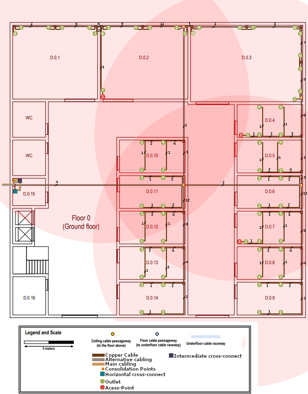
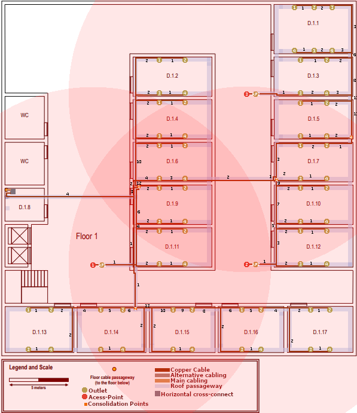

RCOMP 2022-2023 Project - Sprint 1 - Member 1211128 folder
===========================================
# Floor 0 #

## Floor 0 Representation ##

## Floor 0 Technical Info ##

| Room   | Width (m) | Length (m) | Area (m2) |
|--------|:---------:|:----------:|:--------------------:|
| D.0.1  |   8.45    |    7.35    |        62.11         |
| D.0.2  |    8.7    |    7.35    |        63.96         |
| D.0.3  |   11.2    |   7.655    |        85.68         |
| D.0.4  |   6.55    |    3.25    |        21.29         |
| D.0.5  |   6.55    |    3.25    |        21.29         |
| D.0.6  |   6.55    |    3.25    |        21.29         |
| D.0.7  |   6.55    |    3.25    |        21.29         |
| D.0.8  |   6.55    |    3.25    |        21.29         |
| D.0.9  |   6.55    |    3.25    |        21.29         |
| D.0.10 |   6.55    |    3.25    |        21.29         |
| D.0.11 |   6.55    |    3.25    |        21.29         |
| D.0.12 |   6.55    |    3.25    |        21.29         |
| D.0.13 |   6.55    |    3.25    |        21.29         |
| D.0.14 |   6.55    |    3.25    |        21.29         |

### Floor 0 - Fiber Cables

* For the connection of Intermediate Cross-Connect(IC) to Horizontal Cross-Connect(HC) we choose Monomode optical fibre
  because it´s immune/less susceptible to dispersion and thus allows higher data rates.   

### Floor 0 - Cooper Cables

* To connect the Horizontal Cross-Connect(HC) to all Outlets we use Copper Cables CAT7.    
* We chose this cable type they can support faster data transfer rates (10 Gbps) and more simultaneous connections, which
  is important for modern applications.   
* Copper Cables CAT7 are generally more cost-effective than fiber optic cables.   
* Copper Cables CAT7 are compatible with a wide range of network devices.(end-user equipment is not usually prepared for fiber optic cables)   

### Floor 0 - Outlet

* The number of outlets we can place in a room was calculated using the areas previously mentioned.   
* The structured cabling standards say that for each 10m2, we should have at least 2 outlets.  
* There was some care to avoid placing equipment too close to doors to avoid damage.  
* Some areas have more than 2 outlets per 10m2 to provide flexibility for user, for this to happen we make sure that outlets always be
  less than 3m away from others outlets. 

### Floor 0 - Consolidation Point

* For this floor there will be 4 Consolidation Point.  
* 1st on Room D.0.11 that will host outlets of rooms -> D.0.10 to D.0.14
* 2nd on Room D.0.6 that will host outlets of rooms -> D.0.5 to D.0.9
* 3rd on Room D.0.3 that will host outlets of rooms -> D.0.3 and D.0.4
* 4th on Room D.0.2 that will host outlets of rooms -> D.0.1 to D.0.2
* This Consolidation are placed in this local's because this floor will have 69 Outlets, so using this Consolidation Points
  we can avoid to use a Patch Panel of 48 female connectors and can have a better organization on our structured cabling.

### Floor 0 - Access Point

* We choose to place 4 Access Point to this at the top of the main corridor at four different locations  
* Usually an Access Point will grant approximate a 50 meters diameter circle of coverage, but this is relative to an empty area.
  But in a Building like our we have walls that will interfere. So we only are considering a coverage of 30 meters.  
* We choose to place this Access Point on this local because it's near of all rooms.  

### Floor 0 - Horizontal Cross Connect

* The Horizontal cross-connect (HC) was placed in the room D.0.15 because this room it's a storage room and also contains the passageway to the floor above
  and provides easy access to the other rooms on that floor.  

### Floor 0 - Intermediate Cross Connect

* The Intermediate cross-connect (IC) was placed in the room D.0.15 because this room it's a storage room and also contains the passageway to the floor above
  and being the most efficient way regarding the cabling.  

## Floor 0 Inventory ##

#### Floor 0 Inventory - Fiber Cables ####
| Designation                                                 | Quantity (m) |
|-------------------------------------------------------------|:------------:|
| Main Monomode optical fibre cable (Outside to IC )          |     3.5      |
| Main Monomode optical fibre cable (IC to HC Floor 1)        |     4.5      |
| Main Monomode optical fibre cable (IC to HC Floor 0)        |     3.5      |
| Alternative Monomode optical fibre cable (Outside to IC )   |     3.5      |
| Alternative Monomode optical fibre cable (IC to HC Floor 1) |     4.5      |
| Alternative Monomode optical fibre cable (IC to HC Floor 0) |     3.5      |
| Sum Monomode optical fibre cable:                           |      23      |
| Total Monomode optical fibre cable:                         |      46      |
(+)The presented value for Monomode optical fibre cable length present a margin of error.
(+)All Monomode optical fibre cable are included in this inventory
(+)The presented on "Total Monomode optical fibre cable" is the value presented on "Sum Monomode optical fibre cable"
multiplied by 2 because each path have 2 cables.

#### Floor 0 Inventory - Copper Cables ####
| Designation                                                  | Quantity (m) |
|--------------------------------------------------------------|:------------:|
| Copper Cables CAT7 (HC to CP 1)                              |      20      |
| Copper Cables CAT7 (HC to CP 2)                              |      32      |
| Copper Cables CAT7 (HC to CP 3)                              |     40.5     |
| Copper Cables CAT7 (HC to CP 4)                              |      36      |
| Copper Cables CAT7 (CP 2 to CP 3)                            |      11      |
| Copper Cables CAT7 (CP 3 to CP 4)                            |      22      |                                                           |              |
| Copper Cables CAT7 (Room D.0.2 - Outlet 1 to Access Point 1) |     0.2      |
| Copper Cables CAT7 (Room D.0.4 - Outlet 1 to Access Point 2) |     0.2      |
| Copper Cables CAT7 (Room D.0.7 - Outlet 1 to Access Point 3) |     0.2      |
| Copper Cables CAT7 (CP 4 to Room D.0.1 - Outlet 1)           |      10      |
| Copper Cables CAT7 (CP 4 to Room D.0.1 - Outlet 2)           |      10      |
| Copper Cables CAT7 (CP 4 to Room D.0.1 - Outlet 3)           |      15      |
| Copper Cables CAT7 (CP 4 to Room D.0.1 - Outlet 4)           |      15      |
| Copper Cables CAT7 (CP 4 to Room D.0.1 - Outlet 5)           |      19      |
| Copper Cables CAT7 (CP 4 to Room D.0.1 - Outlet 6)           |      19      |
| Copper Cables CAT7 (CP 4 to Room D.0.2 - Outlet 1)           |      1       |
| Copper Cables CAT7 (CP 4 to Room D.0.2 - Outlet 2)           |      1       |
| Copper Cables CAT7 (CP 4 to Room D.0.2 - Outlet 3)           |      6       |
| Copper Cables CAT7 (CP 4 to Room D.0.2 - Outlet 4)           |      6       |
| Copper Cables CAT7 (CP 4 to Room D.0.2 - Outlet 5)           |      10      |
| Copper Cables CAT7 (CP 4 to Room D.0.2 - Outlet 6)           |      10      |
| Copper Cables CAT7 (CP 4 to Room D.0.2 - Outlet 7)           |      20      |                                                            |              |
| Copper Cables CAT7 (CP 3 to Room D.0.3 - Outlet 1)           |      1       |
| Copper Cables CAT7 (CP 3 to Room D.0.3 - Outlet 2)           |      1       |
| Copper Cables CAT7 (CP 3 to Room D.0.3 - Outlet 3)           |      6       |
| Copper Cables CAT7 (CP 3 to Room D.0.3 - Outlet 4)           |      6       |
| Copper Cables CAT7 (CP 3 to Room D.0.3 - Outlet 5)           |      9       |
| Copper Cables CAT7 (CP 3 to Room D.0.3 - Outlet 6)           |      9       |
| Copper Cables CAT7 (CP 3 to Room D.0.3 - Outlet 7)           |      15      |
| Copper Cables CAT7 (CP 3 to Room D.0.3 - Outlet 8)           |      15      |
| Copper Cables CAT7 (CP 3 to Room D.0.3 - Outlet 9)           |     20.5     |
| Copper Cables CAT7 (CP 3 to Room D.0.3 - Outlet 10)          |     20.5     |
| Copper Cables CAT7 (CP 3 to Room D.0.4 - Outlet 1)           |     14.5     |
| Copper Cables CAT7 (CP 3 to Room D.0.4 - Outlet 2)           |     9.5      |
| Copper Cables CAT7 (CP 3 to Room D.0.4 - Outlet 3)           |      7       |
| Copper Cables CAT7 (CP 3 to Room D.0.4 - Outlet 4)           |      12      |
| Copper Cables CAT7 (CP 3 to Room D.0.4 - Outlet 5)           |      10      |
| Copper Cables CAT7 (CP 2 to Room D.0.5 - Outlet 1)           |     6.5      |
| Copper Cables CAT7 (CP 2 to Room D.0.5 - Outlet 2)           |     4.5      |
| Copper Cables CAT7 (CP 2 to Room D.0.5 - Outlet 3)           |     9.5      |
| Copper Cables CAT7 (CP 2 to Room D.0.5 - Outlet 4)           |      8       |
| Copper Cables CAT7 (CP 2 to Room D.0.6 - Outlet 1)           |     7.5      |
| Copper Cables CAT7 (CP 2 to Room D.0.6 - Outlet 2)           |     5.5      |
| Copper Cables CAT7 (CP 2 to Room D.0.6 - Outlet 3)           |      6       |
| Copper Cables CAT7 (CP 2 to Room D.0.6 - Outlet 4)           |      4       |
| Copper Cables CAT7 (CP 2 to Room D.0.7 - Outlet 1)           |     15.5     |
| Copper Cables CAT7 (CP 2 to Room D.0.7 - Outlet 2)           |     10.5     |
| Copper Cables CAT7 (CP 2 to Room D.0.7 - Outlet 3)           |     8.5      |
| Copper Cables CAT7 (CP 2 to Room D.0.7 - Outlet 4)           |      8       |
| Copper Cables CAT7 (CP 2 to Room D.0.7 - Outlet 5)           |      6       |
| Copper Cables CAT7 (CP 2 to Room D.0.8 - Outlet 1)           |     14.5     |
| Copper Cables CAT7 (CP 2 to Room D.0.8 - Outlet 2)           |      12      |
| Copper Cables CAT7 (CP 2 to Room D.0.8 - Outlet 3)           |     11.5     |
| Copper Cables CAT7 (CP 2 to Room D.0.8 - Outlet 4)           |     9.5      |
| Copper Cables CAT7 (CP 2 to Room D.0.9 - Outlet 1)           |     18.5     |
| Copper Cables CAT7 (CP 2 to Room D.0.9 - Outlet 2)           |      16      |
| Copper Cables CAT7 (CP 2 to Room D.0.9 - Outlet 3)           |      15      |
| Copper Cables CAT7 (CP 2 to Room D.0.9 - Outlet 4)           |      13      |
| Copper Cables CAT7 (CP 1 to Room D.0.10 - Outlet 1)          |     12.5     |
| Copper Cables CAT7 (CP 1 to Room D.0.10 - Outlet 2)          |     10.5     |
| Copper Cables CAT7 (CP 1 to Room D.0.10 - Outlet 3)          |      10      |
| Copper Cables CAT7 (CP 1 to Room D.0.10 - Outlet 4)          |     7.5      |
| Copper Cables CAT7 (CP 1 to Room D.0.11 - Outlet 1)          |     7.5      |
| Copper Cables CAT7 (CP 1 to Room D.0.11 - Outlet 2)          |     5.5      |
| Copper Cables CAT7 (CP 1 to Room D.0.11 - Outlet 3)          |      6       |
| Copper Cables CAT7 (CP 1 to Room D.0.11 - Outlet 4)          |      4       |
| Copper Cables CAT7 (CP 1 to Room D.0.12 - Outlet 1)          |      11      |
| Copper Cables CAT7 (CP 1 to Room D.0.12 - Outlet 2)          |     8.5      |
| Copper Cables CAT7 (CP 1 to Room D.0.12 - Outlet 3)          |      8       |
| Copper Cables CAT7 (CP 1 to Room D.0.12 - Outlet 4)          |      6       |
| Copper Cables CAT7 (CP 1 to Room D.0.13 - Outlet 1)          |     14.5     |
| Copper Cables CAT7 (CP 1 to Room D.0.13 - Outlet 2)          |     12.5     |
| Copper Cables CAT7 (CP 1 to Room D.0.13 - Outlet 3)          |     11.5     |
| Copper Cables CAT7 (CP 1 to Room D.0.13 - Outlet 4)          |     9.5      |
| Copper Cables CAT7 (CP 1 to Room D.0.14 - Outlet 1)          |     18.5     |
| Copper Cables CAT7 (CP 1 to Room D.0.14 - Outlet 2)          |      16      |
| Copper Cables CAT7 (CP 1 to Room D.0.14 - Outlet 3)          |     15.5     |
| Copper Cables CAT7 (CP 1 to Room D.0.14 - Outlet 4)          |      13      |                                                            |              |
| Total Copper Cables CAT7 :                                   |    878.1     |

(+)The presented value for Copper Cables CAT7 length present a margin of error.

### Floor 0 Inventory - Intermediate Cross Connect
| Designation              | Quantity |
|--------------------------|:--------:|
| Fiber Patch Panel 24port |    1     |
| Fiber Patch Cords        |    4     |
| Rack 6U                  |    1     |

### Floor 0 Inventory - Horizontal Cross Connect
| Designation               | Quantity |
|---------------------------|:--------:|
| Switch 24port             |    1     |
| Cat7 Patch Panel 24port   |    1     |
| Cat7 Patch Cords  (4 CP ) |    4     |
| Rack 6U                   |    1     |
| Access Point              |    0     |
| Network Outlets           |    0     |

### Floor 0 Inventory - Consolidation Point 1.
| Designation                    | Quantity |
|--------------------------------|:--------:|
| Switch 24port                  |    1     |
| Cat7 Patch Panel 24port        |    1     |
| Cat7 Patch Cords  (20 Outlets) |    20    |
| Rack 3U                        |    1     |
| Network Outlets                |    20    |

### Floor 0 Inventory - Consolidation Point 2.
| Designation             | Quantity |
|-------------------------|:--------:|
| Switch 24port           |    1     |
| Cat7 Patch Panel 24port |    1     |
| Cat7 Patch Cords        |    22    |
| Rack 3U                 |    1     |
| Access Point            |    1     |
| Network Outlets         |    21    |
(+)This consolidation point has an extra patch cord regarding its connexion to CP 3. 

### Floor 0 Inventory - Consolidation Point 3.
| Designation             | Quantity |
|-------------------------|:--------:|
| Switch 24port           |    1     |
| Cat7 Patch Panel 24port |    1     |
| Cat7 Patch Cords        |    17    |
| Rack 3U                 |    1     |
| Access Point            |    1     |
| Network Outlets         |    15    |
(+)This consolidation point has two extra patch cord regarding its connexion to CP 2 and CP 4.

### Floor 0 Inventory - Consolidation Point 4.
| Designation             | Quantity |
|-------------------------|:--------:|
| Switch 24port           |    1     |
| Cat7 Patch Panel 24port |    1     |
| Cat7 Patch Cords        |    14    |
| Rack 3U                 |    1     |
| Access Point            |    1     |
| Network Outlets         |    13    |
(+)This consolidation point has two extra patch cord regarding its connexion to CP 3.

# Floor 1 #

## Floor 1 Representation ##

## Floor 1 Technical Info ##

| Room   | Width | Length |       Area        |
|--------|:-----:|:------:|:-----------------:|
| D.1.1  | 4.05m |  6.5m  | 26.3m2 |
| D.1.2  | 3.2m  |  6.5m  | 20.8m2 |
| D.1.3  | 3.2m  |  6.5m  | 20.8m2 |
| D.1.4  | 3.2m  |  6.5m  | 20.8m2 |
| D.1.5  | 3.2m  |  6.5m  | 20.8m2 |
| D.1.6  | 3.2m  |  6.5m  | 20.8m2 |
| D.1.7  | 3.2m  |  6.5m  | 20.8m2 |
| D.1.9  | 3.2m  |  6.5m  | 20.8m2 |
| D.1.10 | 3.2m  |  6.5m  | 20.8m2 |
| D.1.11 | 3.2m  |  6.5m  | 20.8m2 |
| D.1.12 | 3.2m  |  6.5m  | 20.8m2 |
| D.1.13 | 3.75m |  5.7m  | 21.4m2 |
| D.1.14 | 3.75m |  5.7m  | 21.4m2 |
| D.1.15 | 3.75m |  5.4m  | 20.3m2 |
| D.1.16 | 3.75m |  5.4m  | 20.3m2 |
| D.1.17 | 3.75m |  5.4m  | 20.3m2 |

### Floor 1 - Fiber Cables

* For the connection of Intermediate Cross-Connect(IC) to Horizontal Cross-Connect(HC) we choose Monomode optical fibre
  because it´s immune/less susceptible to dispersion and thus allows higher data rates.   

### Floor 1 - Cooper Cables

* To connect the Horizontal Cross-Connect(HC) to all Outlets we use Copper Cables CAT7.    
* We chose this cable type they can support faster data transfer rates (10 Gbps) and more simultaneous connections, which
  is important for modern applications.   
* Copper Cables CAT7 are generally more cost-effective than fiber optic cables.   
* Copper Cables CAT7 are compatible with a wide range of network devices.(end-user equipment is not usually prepared for fiber optic cables)   

### Floor 1 - Outlet

* The number of outlets we can place in a room was calculated using the areas previously mentioned.   
* The structured cabling standards say that for each 10m2, we should have at least 2 outlets.  
* There was some care to avoid placing equipment too close to doors to avoid damage.  
* Some areas have more than 2 outlets per 10m2 to provide flexibility for user, for this to happen we make sure that outlets always be
  less than 3m away from others outlets. 

### Floor 1 - Consolidation Point

* For this floor there will be 4 Consolidation Point.  
* 1st on Room D.1.9 that will host outlets of rooms -> D.1.2, D.1.4, D.1.6, D.1.9 and D.1.11
* 2nd on Room D.1.14 that will host outlets of rooms -> D.1.13 to D.1.17
* 3rd on Room D.1.7 that will host outlets of rooms -> D.1.7, D.1.10 and D.1.12
* 4th on Room D.1.5 that will host outlets of rooms -> D.1.1, D.1.3 and D.1.5
* This Consolidation are placed in this local's because this floor will have 69 Outlets, so using this Consolidation Points
  we can avoid to use a Patch Panel of 48 female connectors and can have a better organization on our structured cabling.

### Floor 1 - Access Point

* We choose to place 4 Access Point to this at the top of the main corridor at four different locations  
* Usually an Access Point will grant approximate a 50 meters diameter circle of coverage, but this is relative to an empty area.
  But in a Building like our we have walls that will interfere. So we only are considering a coverage of 30 meters.  
* We choose to place this Access Point on this local because it's near of all rooms.  

### Floor 1 - Horizontal Cross Connect

* The Horizontal cross-connect (HC) was placed in the room D.1.8 because this room it's a storage room and also contains the passageway to the floor above
  and provides easy access to the other rooms on that floor.  

## Floor 1 Inventory ##

#### Floor 1 Inventory - Copper Cables ####
| Designation                                                   | Quantity (m) |
|---------------------------------------------------------------|:------------:|
| Copper Cables CAT7 (HC to CP 1)                               |      14      |
| Copper Cables CAT7 (HC to CP 2)                               |      22      |
| Copper Cables CAT7 (HC to CP 3)                               |      26      |
| Copper Cables CAT7 (HC to CP 4)                               |      36      |
| Copper Cables CAT7 (Room D.1.3 - Outlet 1 to Access Point 1)  |     0.2      |
| Copper Cables CAT7 (Room D.1.11 - Outlet 1 to Access Point 2) |     0.2      |
| Copper Cables CAT7 (Room D.1.12 - Outlet 1 to Access Point 3) |     0.2      |
| Copper Cables CAT7 (CP 1 to Outlet AP1)                       |     10.5     |
| Copper Cables CAT7 (CP 1 to Room D.1.2 - Outlet 1)            |     16.5     |
| Copper Cables CAT7 (CP 1 to Room D.1.2 - Outlet 2)            |      18      |
| Copper Cables CAT7 (CP 1 to Room D.1.2 - Outlet 3)            |      13      |
| Copper Cables CAT7 (CP 1 to Room D.1.2 - Outlet 4)            |      15      |
| Copper Cables CAT7 (CP 1 to Room D.1.4 - Outlet 1)            |     12.5     |
| Copper Cables CAT7 (CP 1 to Room D.1.4 - Outlet 2)            |      15      |
| Copper Cables CAT7 (CP 1 to Room D.1.4 - Outlet 3)            |     9.5      |
| Copper Cables CAT7 (CP 1 to Room D.1.4 - Outlet 4)            |     11.5     |
| Copper Cables CAT7 (CP 1 to Room D.1.6 - Outlet 1)            |      9       |
| Copper Cables CAT7 (CP 1 to Room D.1.6 - Outlet 2)            |      11      |
| Copper Cables CAT7 (CP 1 to Room D.1.6 - Outlet 3)            |      6       |
| Copper Cables CAT7 (CP 1 to Room D.1.6 - Outlet 4)            |      8       |
| Copper Cables CAT7 (CP 1 to Room D.1.9 - Outlet 1)            |      2       |
| Copper Cables CAT7 (CP 1 to Room D.1.9 - Outlet 2)            |      7       |
| Copper Cables CAT7 (CP 1 to Room D.1.9 - Outlet 3)            |     8.5      |
| Copper Cables CAT7 (CP 1 to Room D.1.9 - Outlet 4)            |     10.5     |
| Copper Cables CAT7 (CP 1 to Room D.1.11 - Outlet 1)           |      9       |
| Copper Cables CAT7 (CP 1 to Room D.1.11 - Outlet 2)           |      11      |
| Copper Cables CAT7 (CP 1 to Room D.1.11 - Outlet 3)           |      12      |
| Copper Cables CAT7 (CP 1 to Room D.1.11 - Outlet 4)           |      14      |
| Copper Cables CAT7 (CP 2 to Room D.1.13 - Outlet 1)           |     12.5     |
| Copper Cables CAT7 (CP 2 to Room D.1.13 - Outlet 2)           |     10.5     |
| Copper Cables CAT7 (CP 2 to Room D.1.13 - Outlet 3)           |      16      |
| Copper Cables CAT7 (CP 2 to Room D.1.13 - Outlet 4)           |      14      |
| Copper Cables CAT7 (CP 2 to Room D.1.14 - Outlet 1)           |      6       |
| Copper Cables CAT7 (CP 2 to Room D.1.14 - Outlet 2)           |     4.5      |
| Copper Cables CAT7 (CP 2 to Room D.1.14 - Outlet 3)           |      11      |
| Copper Cables CAT7 (CP 2 to Room D.1.14 - Outlet 4)           |     9.5      |
| Copper Cables CAT7 (CP 2 to Room D.1.15 - Outlet 1)           |     6.5      |
| Copper Cables CAT7 (CP 2 to Room D.1.15 - Outlet 2)           |      8       |
| Copper Cables CAT7 (CP 2 to Room D.1.15 - Outlet 3)           |      10      |
| Copper Cables CAT7 (CP 2 to Room D.1.15 - Outlet 4)           |     11.5     |
| Copper Cables CAT7 (CP 2 to Room D.1.16 - Outlet 1)           |      12      |
| Copper Cables CAT7 (CP 2 to Room D.1.16 - Outlet 2)           |     13.5     |
| Copper Cables CAT7 (CP 2 to Room D.1.16 - Outlet 3)           |      16      |
| Copper Cables CAT7 (CP 2 to Room D.1.16 - Outlet 4)           |     17.5     |
| Copper Cables CAT7 (CP 2 to Room D.1.17 - Outlet 1)           |      18      |
| Copper Cables CAT7 (CP 2 to Room D.1.17 - Outlet 2)           |     19.5     |
| Copper Cables CAT7 (CP 2 to Room D.1.17 - Outlet 3)           |     21.5     |
| Copper Cables CAT7 (CP 2 to Room D.1.17 - Outlet 4)           |      23      |
| Copper Cables CAT7 (CP 3 to Outlet AP2)                       |      10      |
| Copper Cables CAT7 (CP 3 to Room D.1.7 - Outlet 1)            |      7       |
| Copper Cables CAT7 (CP 3 to Room D.1.7 - Outlet 2)            |     10.5     |
| Copper Cables CAT7 (CP 3 to Room D.1.7 - Outlet 3)            |      5       |
| Copper Cables CAT7 (CP 3 to Room D.1.7 - Outlet 4)            |     7.5      |
| Copper Cables CAT7 (CP 3 to Room D.1.10 - Outlet 1)           |      6       |
| Copper Cables CAT7 (CP 3 to Room D.1.10 - Outlet 2)           |      8       |
| Copper Cables CAT7 (CP 3 to Room D.1.10 - Outlet 3)           |      9       |
| Copper Cables CAT7 (CP 3 to Room D.1.10 - Outlet 4)           |      11      |
| Copper Cables CAT7 (CP 3 to Room D.1.12 - Outlet 1)           |     9.5      |
| Copper Cables CAT7 (CP 3 to Room D.1.12 - Outlet 2)           |     11.5     |
| Copper Cables CAT7 (CP 3 to Room D.1.12 - Outlet 3)           |     12.5     |
| Copper Cables CAT7 (CP 3 to Room D.1.12 - Outlet 4)           |     14.5     |
| Copper Cables CAT7 (CP 4 to Outlet AP3)                       |      13      |
| Copper Cables CAT7 (CP 3 to Room D.1.1 - Outlet 1)            |      19      |
| Copper Cables CAT7 (CP 3 to Room D.1.1 - Outlet 2)            |     17.5     |
| Copper Cables CAT7 (CP 3 to Room D.1.1 - Outlet 3)            |      16      |
| Copper Cables CAT7 (CP 3 to Room D.1.1 - Outlet 4)            |      15      |
| Copper Cables CAT7 (CP 3 to Room D.1.1 - Outlet 5)            |     13.5     |
| Copper Cables CAT7 (CP 3 to Room D.1.1 - Outlet 6)            |      12      |
| Copper Cables CAT7 (CP 3 to Room D.1.3 - Outlet 1)            |      14      |
| Copper Cables CAT7 (CP 3 to Room D.1.3 - Outlet 2)            |      12      |
| Copper Cables CAT7 (CP 3 to Room D.1.3 - Outlet 3)            |      11      |
| Copper Cables CAT7 (CP 3 to Room D.1.3 - Outlet 4)            |      9       |
| Copper Cables CAT7 (CP 3 to Room D.1.5 - Outlet 1)            |      11      |
| Copper Cables CAT7 (CP 3 to Room D.1.5 - Outlet 2)            |     8.5      |
| Copper Cables CAT7 (CP 3 to Room D.1.5 - Outlet 3)            |     7.5      |
| Copper Cables CAT7 (CP 3 to Room D.1.5 - Outlet 4)            |     5.5      |
| Total Copper Cables CAT7 :                                    |    903.6     |
(+)The presented value for Monomode optical fibre cable length present a margin of error.
(+)Monomode optical fibre cable are included in the inventory of Floor 0.

### Floor 1 Inventory - Horizontal Cross Connect
| Designation               | Quantity |
|---------------------------|:--------:|
| Switch 24port             |    1     |
| Cat7 Patch Panel 24port   |    1     |
| Cat7 Patch Cords  (4 CP ) |    4     |
| Rack 6U                   |    1     |
| Access Point              |    0     |
| Network Outlets           |    0     |

### Floor 0 Inventory - Consolidation Point 1.
| Designation                    | Quantity |
|--------------------------------|:--------:|
| Switch 24port                  |    1     |
| Cat7 Patch Panel 24port        |    1     |
| Cat7 Patch Cords  (21 Outlets) |    21    |
| Rack 3U                        |    1     |
| Network Outlets                |    21    |

### Floor 0 Inventory - Consolidation Point 2.
| Designation             | Quantity |
|-------------------------|:--------:|
| Switch 24port           |    1     |
| Cat7 Patch Panel 24port |    1     |
| Cat7 Patch Cords        |    20    |
| Rack 3U                 |    1     |
| Network Outlets         |    20    |

### Floor 0 Inventory - Consolidation Point 3.
| Designation             | Quantity |
|-------------------------|:--------:|
| Switch 24port           |    1     |
| Cat7 Patch Panel 24port |    1     |
| Cat7 Patch Cords        |    13    |
| Rack 3U                 |    1     |
| Access Point            |    1     |
| Network Outlets         |    13    |

### Floor 0 Inventory - Consolidation Point 4.
| Designation             | Quantity |
|-------------------------|:--------:|
| Switch 24port           |    1     |
| Cat7 Patch Panel 24port |    1     |
| Cat7 Patch Cords        |    15    |
| Rack 3U                 |    1     |
| Access Point            |    1     |
| Network Outlets         |    15    |