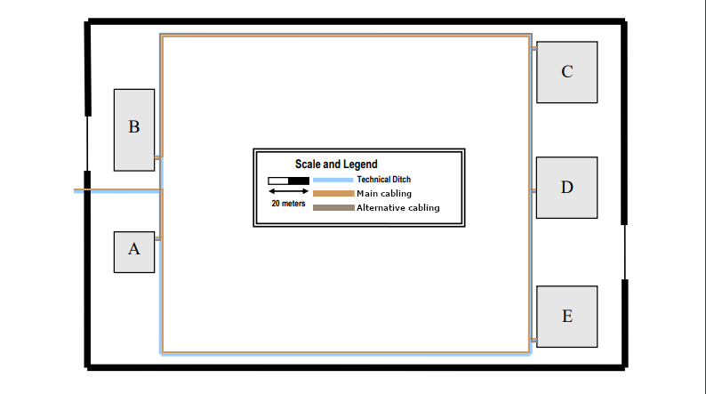
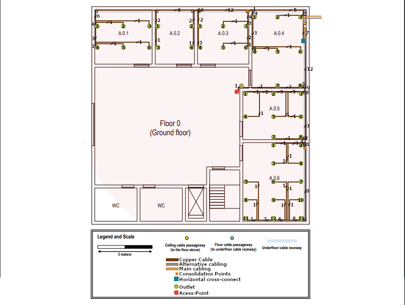
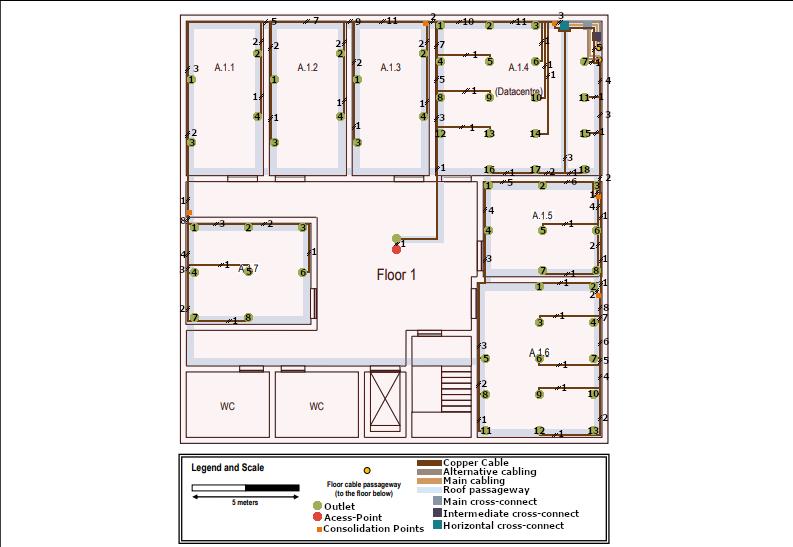

RCOMP 2022-2023 Project - Sprint 1 - Member 1211131 folder
===========================================

# Campus Backbone #

## Campus Backbone Representation ##

(+)Each cable path represented in the image represents two Monomode optical fibre cables.
## Campus Technical Info ##

The campus backbone consists in the connections between the Main Cross-Connect (MC) and all the buildings 
Intermediate Cross-Connects (IC).  

* Main Cross-Connect (MC) its located on building A, Floor 0, Room A.1.4 (Datacenter).   

* Each Building have an Intermediate Cross-Connects (IC).   

* The perimeter of the Campus is large, so the cable type chosen for the campus backbone was 
**Monomode optical fibre** because it´s greater for long transmission distances, it´s immune/less susceptible to dispersion and thus allows
higher data rates.   

* It's applied Cabling **redundancy**(2 cable path, each one have 2 cables), this is an important implementation
because assures that if a cable fails or is obstructed due building works, the network stays functional, its also 
important because all alternative cables can be used at the same time to transmit data whit **load balancing**.   

## Campus Inventory ##
| Designation                                          | Quantity |
|------------------------------------------------------|:--------:|
| Monomode optical fibre cable (Entrance-Building A)   |  69.5m   |
| Monomode optical fibre cable (Building A-Building E) |  245.5m  |
| Monomode optical fibre cable (Building E-Building D) |   78m    |
| Monomode optical fibre cable (Building D-Building C) |  74.5m   |
| Monomode optical fibre cable (Building C-Building B) |   246m   |
| Monomode optical fibre cable (Building A-Building B) |  45.5m   |
| Monomode optical fibre cable (Building B-Building C) |   246m   |
| Monomode optical fibre cable (Building C-Building D) |  74.5m   |
| Monomode optical fibre cable (Building D-Building E) |   78m    |
| Sum Monomode optical fibre cable:                    | 1157.5m  |
| Total Monomode optical fibre cable:                  |  2315m   |
(+)The presented value for Monomode optical fibre cable length present a margin of error.
(+)The presented on "Total Monomode optical fibre cable" is the value presented on "Sum Monomode optical fibre cable"
multiplied by 2 because each path have 2 cables.

# Floor 0 #

## Floor 0 Representation ##

## Floor 0 Technical Info ##

| Room  | Width | Length |        Area        |
|-------|:-----:|:------:|:------------------:|
| A.0.1 | 5.5m  |   5m   | 27.5m2  |
| A.0.2 | 3.5m  |   5m   | 17.5m2  |
| A.0.3 | 4.5m  |   5m   | 22.5m2  |
| A.0.4 |  5m   |   7m   |  35m2   |
| A.0.5 | 5.5m  |  4.5m  | 24.75m2 |
| A.0.6 | 5.5m  |   7m   | 38.5m2  |

### Floor 0 - Fiber Cables 

* For the connection of Intermediate Cross-Connect(IC) to Horizontal Cross-Connect(HC) we choose Monomode optical fibre
 because it´s immune/less susceptible to dispersion and thus allows higher data rates.   

### Floor 0 - Cooper Cables 

* To connect the Horizontal Cross-Connect(HC) to all Outlets we use Copper Cables CAT7.    
* We chose this cable type they can support faster data transfer rates (10 Gbps) and more simultaneous connections, which 
is important for modern applications.   
* Copper Cables CAT7 are generally more cost-effective than fiber optic cables.   
* Copper Cables CAT7 are compatible with a wide range of network devices.(end-user equipment is not usually prepared for fiber optic cables)   

### Floor 0 - Outlet 

* The number of outlets we can place in a room was calculated using the areas previously mentioned.   
* The structured cabling standards say that for each 10m2, we should have at least 2 outlets.  
* There was some care to avoid placing equipment too close to doors to avoid damage.  
* Some areas have more than 2 outlets per 10m2 to provide flexibility for user, for this to happen we make sure that outlets always be 
less than 3m away from others outlets. 

### Floor 0 - Consolidation Point

* For this floor there will be 2 Consolidation Point.  
* 1st on Room A.0.3 that will host outlets of rooms -> A.0.1, A.0.2 and A.0.3.  
* 2nd on Room A.0.6 that will host outlets of room A.0.6.  
* This Consolidation are placed in this local's because this floor will have 46 Outlets, so using this Consolidation Points
we can avoid to use a Patch Panel of 48 female connectors and can have a better organization on our structured cabling.

### Floor 0 - Access Point 

* We choose to place 1 Access Point to this at the top outside the wall of Room A.0.5.  
* Usually an Access Point will grant approximate a 50 meters diameter circle of coverage, but this is relative to an empty area.
But in a Building like our we have walls that will interfere. So we only are considering a coverage of 30 meters.  
* We choose to place this Access Point on this local because it's near of all rooms and have less interference from walls 
than if it was placed inside a room.  

### Floor 0 - Horizontal Cross Connect

* The Horizontal cross-connect (HC) was placed in the room A.0.4 because this room it's  contains the passageway to the floor above
and provides easy access to the other rooms on that floor.  

## Floor 0 Inventory ##

### Floor 0 Inventory - Fiber Cables 
| Designation                                                 | Quantity |
|-------------------------------------------------------------|:--------:|
| Main Monomode optical fibre cable (Outside to MC)           |    7m    |
| Main Monomode optical fibre cable (MC to Outside)           |    7m    |
| Main Monomode optical fibre cable (MC to IC )               |    1m    |
| Main Monomode optical fibre cable (IC to HC Floor 1)        |    1m    |
| Main Monomode optical fibre cable (IC to HC Floor 0)        |    7m    |
| Alternative Monomode optical fibre cable (Outside to MC)    |    7m    |
| Alternative Monomode optical fibre cable (MC to Outside)    |    7m    |
| Alternative Monomode optical fibre cable (MC to IC )        |    1m    |
| Alternative Monomode optical fibre cable (IC to HC Floor 1) |    1m    |
| Alternative Monomode optical fibre cable (IC to HC Floor 0) |    7m    |
| Sum Monomode optical fibre cable:                           |   46m    |
| Total Monomode optical fibre cable:                         |   92m    |
(+)The presented value for Monomode optical fibre cable length present a margin of error.
(+)All Monomode optical fibre cable are included in this inventory
(+)The presented on "Total Monomode optical fibre cable" is the value presented on "Sum Monomode optical fibre cable"
multiplied by 2 because each path have 2 cables.

### Floor 0 Inventory - Copper Cables 
| Designation                                                                                   | Quantity |
|-----------------------------------------------------------------------------------------------|:--------:|
| Copper Cables CAT7 (HC to Consolidation Point of Room's(A.01, A.02, A.03)                     |   7.7m   |
| Copper Cables CAT7 (Consolidation Point of Room's(A.01, A.02, A.03) to Room A.0.1 - Outlet 1) |  15.2m   |
| Copper Cables CAT7 (Consolidation Point of Room's(A.01, A.02, A.03) to Room A.0.1 - Outlet 2) |  17.5m   |
| Copper Cables CAT7 (Consolidation Point of Room's(A.01, A.02, A.03) to Room A.0.1 - Outlet 3) |  19.8m   |
| Copper Cables CAT7 (Consolidation Point of Room's(A.01, A.02, A.03) to Room A.0.1 - Outlet 4) |  16.9m   |
| Copper Cables CAT7 (Consolidation Point of Room's(A.01, A.02, A.03) to Room A.0.1 - Outlet 5) |  19.5m   |
| Copper Cables CAT7 (Consolidation Point of Room's(A.01, A.02, A.03) to Room A.0.1 - Outlet 6) |  21.8m   |
| Copper Cables CAT7 (Consolidation Point of Room's(A.01, A.02, A.03) to Room A.0.2 - Outlet 1) |   9.6m   |
| Copper Cables CAT7 (Consolidation Point of Room's(A.01, A.02, A.03) to Room A.0.2 - Outlet 2) |   6.3m   |
| Copper Cables CAT7 (Consolidation Point of Room's(A.01, A.02, A.03) to Room A.0.2 - Outlet 3) |  11.5m   |
| Copper Cables CAT7 (Consolidation Point of Room's(A.01, A.02, A.03) to Room A.0.2 - Outlet 4) |   8.2m   |
| Copper Cables CAT7 (Consolidation Point of Room's(A.01, A.02, A.03) to Room A.0.3 - Outlet 1) |   5.9m   |
| Copper Cables CAT7 (Consolidation Point of Room's(A.01, A.02, A.03) to Room A.0.3 - Outlet 2) |   3.4m   |
| Copper Cables CAT7 (Consolidation Point of Room's(A.01, A.02, A.03) to Room A.0.3 - Outlet 3) |   1.5m   |
| Copper Cables CAT7 (Consolidation Point of Room's(A.01, A.02, A.03) to Room A.0.3 - Outlet 4) |   7.8m   |
| Copper Cables CAT7 (Consolidation Point of Room's(A.01, A.02, A.03) to Room A.0.3 - Outlet 5) |   5.3m   |
| Copper Cables CAT7 (Consolidation Point of Room's(A.01, A.02, A.03) to Room A.0.3 - Outlet 6) |   3.4m   |
| Copper Cables CAT7 (HC to Room A.0.4 - Outlet 1)                                              |   7.6m   |
| Copper Cables CAT7 (HC to Room A.0.4 - Outlet 2)                                              |   4.4m   |
| Copper Cables CAT7 (HC to Room A.0.4 - Outlet 3)                                              |   2.2m   |
| Copper Cables CAT7 (HC to Room A.0.4 - Outlet 4)                                              |  10.7m   |
| Copper Cables CAT7 (HC to Room A.0.4 - Outlet 5)                                              |  12.8m   |
| Copper Cables CAT7 (HC to Room A.0.4 - Outlet 6)                                              |   15m    |
| Copper Cables CAT7 (HC to Room A.0.4 - Outlet 7)                                              |   6.5m   |
| Copper Cables CAT7 (HC to Room A.0.4 - Outlet 8)                                              |   4.5m   |
| Copper Cables CAT7 (HC to Room A.0.5 - Outlet 1)                                              |   10m    |
| Copper Cables CAT7 (HC to Room A.0.5 - Outlet 2)                                              |    7m    |
| Copper Cables CAT7 (HC to Room A.0.5 - Outlet 3)                                              |    5m    |
| Copper Cables CAT7 (HC to Room A.0.5 - Outlet 4)                                              |   12m    |
| Copper Cables CAT7 (HC to Room A.0.5 - Outlet 5)                                              |    9m    |
| Copper Cables CAT7 (HC to Room A.0.5 - Outlet 6)                                              |    9m    |
| Copper Cables CAT7 (HC to Room A.0.5 - Outlet 7)                                              |    7m    |
| Copper Cables CAT7 (HC to Room A.0.5 - Outlet 8)                                              |    9m    |
| Copper Cables CAT7 (HC to Consolidation Point of Room A.06)                                   |   9.5m   |
| Copper Cables CAT7 (Consolidation Point of Room A.06 - Outlet 1)                              |    3m    |
| Copper Cables CAT7 (Consolidation Point of Room A.06 - Outlet 2)                              |   0.5m   |
| Copper Cables CAT7 (Consolidation Point of Room A.06 - Outlet 3)                              |    4m    |
| Copper Cables CAT7 (Consolidation Point of Room A.06 - Outlet 4)                              |    4m    |
| Copper Cables CAT7 (Consolidation Point of Room A.06 - Outlet 5)                              |   15m    |
| Copper Cables CAT7 (Consolidation Point of Room A.06 - Outlet 6)                              |   12m    |
| Copper Cables CAT7 (Consolidation Point of Room A.06 - Outlet 7)                              |   12m    |
| Copper Cables CAT7 (Consolidation Point of Room A.06 - Outlet 8)                              |  13.5m   |
| Copper Cables CAT7 (Consolidation Point of Room A.06 - Outlet 9)                              |   11m    |
| Copper Cables CAT7 (Consolidation Point of Room A.06 - Outlet 10)                             |   11m    |
| Copper Cables CAT7 (Consolidation Point of Room A.06 - Outlet 11)                             |  11.5m   |
| Copper Cables CAT7 (Consolidation Point of Room A.06 - Outlet 12)                             |   9.5m   |
| Copper Cables CAT7 (Consolidation Point of Room A.06 - Outlet 13)                             |    7m    |
| Copper Cables CAT7 (HC - Outlet Access Point)                                                 |  13.6m   |
| Copper Cables CAT7 (Outlet Access Point - Access Point)                                       |   0.4m   |
| Total Copper Cables CAT7 :                                                                    |  450.5m  |

(+)The presented value for Copper Cables CAT7 length present a margin of error.

### Floor 0 Inventory - Horizontal Cross Connect
| Designation                                          | Quantity |
|------------------------------------------------------|:--------:|
| Switch 32port                                        |    1     |
| Cat7 Patch Panel 24port                              |    1     |
| Cat7 Patch Cords  (2 CP + 17 Outlets + Access Point) |    19    |
| Rack 6U                                              |    1     |
| Access Point                                         |    1     |
| Network Outlets                                      |    17    |

### Floor 0 Inventory - Consolidation Point Room A.0.1, A.0.2 and A.0.3.
| Designation                    | Quantity |
|--------------------------------|:--------:|
| Switch 24port                  |    1     |
| Cat7 Patch Panel 24port        |    1     |
| Cat7 Patch Cords  (16 Outlets) |    16    |
| Rack 3U                        |    1     |
| Network Outlets                |    16    |

### Floor 0 Inventory - Consolidation Point of Room A.0.6.
| Designation                    | Quantity |
|--------------------------------|:--------:|
| Switch 24port                  |    1     |
| Cat7 Patch Panel 24port        |    1     |
| Cat7 Patch Cords  (13 Outlets) |    13    |
| Rack 3U                        |    1     |
| Network Outlets                |    13    |

### Floor 0 Inventory - Others 
| Designation             | Quantity |
|-------------------------|:--------:|
| Cable protection gutter |   120m   |
(+) The value presented have a margin of error.

# Floor 1 #

## Floor 1 Representation ##

(+)The path "Roof passageway" is represented on this image to have a better organization of the structured cabling through the ceiling

## Floor 1 Technical Info ##

| Room  | Width | Length |        Area        |
|-------|:-----:|:------:|:------------------:|
| A.1.1 | 3.5m  |   7m   | 24.5m2  |
| A.1.2 | 3.5m  |   7m   | 24.5m2  |
| A.1.3 | 3.5m  |   7m   | 24.5m2  |
| A.1.4 | 7.5m  |   7m   | 52.5m2  |
| A.1.5 | 5.5m  |  4.5m  | 24.75m2 |
| A.1.6 |  6m   |   7m   |  42m2   |
| A.1.6 | 5.5m  |  4.5m  | 24.75m2 |

### Floor 1 - Fiber Cables 

* For the connection of Horizontal Cross-Connect(MC) to Intermediate Cross-Connect(IC) we choose Monomode optical fibre
  as we justify earlier because it´s greater for long transmission distances, it´s immune/less susceptible to dispersion and
  thus allows higher data rates.   

* For the connection of Intermediate Cross-Connect(IC) to Horizontal Cross-Connect(HC) we choose Monomode optical fibre
because it´s immune/less susceptible to dispersion and thus allows higher data rates.   

### Floor 1 - Cooper Cables 
* To connect the Horizontal Cross-Connect(HC) to all Outlets we use Copper Cables CAT7.    
* We chose this cable type they can support faster data transfer rates (10 Gbps) and more simultaneous connections, which
  is important for modern applications.   
* Copper Cables CAT7 are generally more cost-effective than fiber optic cables.   
* Copper Cables CAT7 are compatible with a wide range of network devices.(end-user equipment is not usually prepared for fiber optic cables)   

### Floor 1 - Outlet 

* The number of outlets we can place in a room was calculated using the areas previously mentioned.   
* The structured cabling standards say that for each 10m2, we should have at least 2 outlets.  
* There was some care to avoid placing equipment too close to doors to avoid damage.  
* Some areas have more than 2 outlets per 10m2 to provide flexibility for user, for this to happen we make sure that outlets always be
  less than 3m away from others outlets. 

### Floor 1 - Consolidation Point 

* For this floor there will be 5 Consolidation Point.  
* 1st on Room A.1.3 that will host outlets of rooms -> A.1.1, A.1.2 and A.1.3.  
* 2nd on Room A.1.4 that will host outlets of room A.1.4.  
* 3rd on Room A.1.5 that will host outlets of room A.1.5.  
* 4th on Room A.1.6 that will host outlets of room A.1.6.  
* 5th on Room A.1.7 that will host outlets of room A.1.7.  
* This Consolidation are placed in this local's because this floor will have 60 Outlets, so using this Consolidation Points
  we need to use CP, and we can have a better organization on our structured cabling.

### Floor 1 - Access Point 

* We choose to place 1 Access Point to this at the middle of the ceiling.  
* Usually an Access Point will grant approximate a 50 meters diameter circle of coverage, but this is relative to an empty area.
  But in a Building like our we have walls that will interfere. So we only are considering a coverage of 30 meters.  
* We choose to place this Access Point on this local because it's centralized, at the same distance and near of all rooms and have less interference from walls
  than if it was placed inside a room.  

### Floor 1 - Main Cross Connect
* Since this building houses the Main cross-connect (MC), it was placed on the datacenter (Room 1.4). 

### Floor 1 - Intermediate Cross Connect
* The Intermediate cross-connect (IC) was placed in the same room as the MC to be closer to it and closer to the cable passageway to the floor below.

### Floor 1 - Horizontal Cross Connect
 * The Horizontal cross-connect (HC) was placed in the same room as the MC and IC to be closer to it and provides easy access to the other rooms on that floor.

## Floor 1 Inventory ##

### Floor 1 Inventory - Copper Cables 
| Designation                                                                                   | Quantity |
|-----------------------------------------------------------------------------------------------|:--------:|
| Copper Cables CAT7 (HC to Consolidation Point of Room's(A.11, A.12, A.13)                     |   8.7m   |
| Copper Cables CAT7 (Consolidation Point of Room's(A.11, A.12, A.13) to Room A.1.1 - Outlet 1) |  16.4m   |
| Copper Cables CAT7 (Consolidation Point of Room's(A.11, A.12, A.13) to Room A.1.1 - Outlet 2) |  11.8m   |
| Copper Cables CAT7 (Consolidation Point of Room's(A.11, A.12, A.13) to Room A.1.1 - Outlet 3) |  19.3m   |
| Copper Cables CAT7 (Consolidation Point of Room's(A.11, A.12, A.13) to Room A.1.1 - Outlet 4) |  14.6m   |
| Copper Cables CAT7 (Consolidation Point of Room's(A.11, A.12, A.13) to Room A.1.2 - Outlet 1) |  12.6m   |
| Copper Cables CAT7 (Consolidation Point of Room's(A.11, A.12, A.13) to Room A.1.2 - Outlet 2) |    8m    |
| Copper Cables CAT7 (Consolidation Point of Room's(A.11, A.12, A.13) to Room A.1.2 - Outlet 3) |  15.5m   |
| Copper Cables CAT7 (Consolidation Point of Room's(A.11, A.12, A.13) to Room A.1.2 - Outlet 4) |  10.8m   |
| Copper Cables CAT7 (Consolidation Point of Room's(A.11, A.12, A.13) to Room A.1.3 - Outlet 1) |   8.8m   |
| Copper Cables CAT7 (Consolidation Point of Room's(A.11, A.12, A.13) to Room A.1.3 - Outlet 2) |   4.4m   |
| Copper Cables CAT7 (Consolidation Point of Room's(A.11, A.12, A.13) to Room A.1.3 - Outlet 3) |  11.7m   |
| Copper Cables CAT7 (Consolidation Point of Room's(A.11, A.12, A.13) to Room A.1.3 - Outlet 4) |   7.2m   |
| Copper Cables CAT7 (HC to Consolidation Point of Room A.14)                                   |   0.2m   |
| Copper Cables CAT7 (Consolidation Point of Room A.14 to Room A.1.4 - Outlet 1)                |    8m    |
| Copper Cables CAT7 (Consolidation Point of Room A.14 to Room A.1.4 - Outlet 2)                |   5.8m   |
| Copper Cables CAT7 (Consolidation Point of Room A.14 to Room A.1.4 - Outlet 3)                |   3.8m   |
| Copper Cables CAT7 (Consolidation Point of Room A.14 to Room A.1.4 - Outlet 4)                |   9.8m   |
| Copper Cables CAT7 (Consolidation Point of Room A.14 to Room A.1.4 - Outlet 5)                |  12.3m   |
| Copper Cables CAT7 (Consolidation Point of Room A.14 to Room A.1.4 - Outlet 6)                |   5.2m   |
| Copper Cables CAT7 (Consolidation Point of Room A.14 to Room A.1.4 - Outlet 7)                |   6.9m   |
| Copper Cables CAT7 (Consolidation Point of Room A.14 to Room A.1.4 - Outlet 8)                |  11.6m   |
| Copper Cables CAT7 (Consolidation Point of Room A.14 to Room A.1.4 - Outlet 9)                |  14.1m   |
| Copper Cables CAT7 (Consolidation Point of Room A.14 to Room A.1.4 - Outlet 10)               |    7m    |
| Copper Cables CAT7 (Consolidation Point of Room A.14 to Room A.1.4 - Outlet 11)               |   8.9m   |
| Copper Cables CAT7 (Consolidation Point of Room A.14 to Room A.1.4 - Outlet 12)               |  13.3m   |
| Copper Cables CAT7 (Consolidation Point of Room A.14 to Room A.1.4 - Outlet 13)               |  15.7m   |
| Copper Cables CAT7 (Consolidation Point of Room A.14 to Room A.1.4 - Outlet 14)               |   8.8m   |
| Copper Cables CAT7 (Consolidation Point of Room A.14 to Room A.1.4 - Outlet 15)               |  10.8m   |
| Copper Cables CAT7 (Consolidation Point of Room A.14 to Room A.1.4 - Outlet 16)               |  13.5m   |
| Copper Cables CAT7 (Consolidation Point of Room A.14 to Room A.1.4 - Outlet 17)               |  11.5m   |
| Copper Cables CAT7 (Consolidation Point of Room A.14 to Room A.1.4 - Outlet 18)               |  11.1m   |
| Copper Cables CAT7 (HC to Consolidation Point of Room A.15)                                   |   12m    |
| Copper Cables CAT7 (Consolidation Point of Room A.15 to Room A.1.5 - Outlet 1)                |  11.1m   |
| Copper Cables CAT7 (Consolidation Point of Room A.15 to Room A.1.5 - Outlet 2)                |   6.3m   |
| Copper Cables CAT7 (Consolidation Point of Room A.15 to Room A.1.5 - Outlet 3)                |   3.3m   |
| Copper Cables CAT7 (Consolidation Point of Room A.15 to Room A.1.5 - Outlet 4)                |  13.4m   |
| Copper Cables CAT7 (Consolidation Point of Room A.15 to Room A.1.5 - Outlet 5)                |   6.7m   |
| Copper Cables CAT7 (Consolidation Point of Room A.15 to Room A.1.5 - Outlet 6)                |   4.3m   |
| Copper Cables CAT7 (Consolidation Point of Room A.15 to Room A.1.5 - Outlet 7)                |    9m    |
| Copper Cables CAT7 (Consolidation Point of Room A.15 to Room A.1.5 - Outlet 8)                |   6.2m   |
| Copper Cables CAT7 (HC to Consolidation Point of Room A.16)                                   |  16.4m   |
| Copper Cables CAT7 (Consolidation Point of Room A.16 to Room A.1.6 - Outlet 1)                |   6.1m   |
| Copper Cables CAT7 (Consolidation Point of Room A.16 to Room A.1.6 - Outlet 2)                |   3.3m   |
| Copper Cables CAT7 (Consolidation Point of Room A.16 to Room A.1.6 - Outlet 3)                |   6.7m   |
| Copper Cables CAT7 (Consolidation Point of Room A.16 to Room A.1.6 - Outlet 4)                |   4.2m   |
| Copper Cables CAT7 (Consolidation Point of Room A.15 to Room A.1.6 - Outlet 5)                |  19.7m   |
| Copper Cables CAT7 (Consolidation Point of Room A.16 to Room A.1.6 - Outlet 6)                |    9m    |
| Copper Cables CAT7 (Consolidation Point of Room A.16 to Room A.1.6 - Outlet 7)                |   5.9m   |
| Copper Cables CAT7 (Consolidation Point of Room A.15 to Room A.1.6 - Outlet 8)                |   22m    |
| Copper Cables CAT7 (Consolidation Point of Room A.16 to Room A.1.6 - Outlet 9)                |   9.9m   |
| Copper Cables CAT7 (Consolidation Point of Room A.16 to Room A.1.6 - Outlet 10)               |   7.5m   |
| Copper Cables CAT7 (Consolidation Point of Room A.15 to Room A.1.6 - Outlet 11)               |  23.9m   |
| Copper Cables CAT7 (Consolidation Point of Room A.16 to Room A.1.6 - Outlet 12)               |  12.2m   |
| Copper Cables CAT7 (Consolidation Point of Room A.16 to Room A.1.6 - Outlet 13)               |   9.5m   |
| Copper Cables CAT7 (HC to Consolidation Point of Room A.17)                                   |  27.6m   |
| Copper Cables CAT7 (Consolidation Point of Room A.17 to Room A.1.7 - Outlet 1)                |   3.5m   |
| Copper Cables CAT7 (Consolidation Point of Room A.17 to Room A.1.7 - Outlet 2)                |   6.1m   |
| Copper Cables CAT7 (Consolidation Point of Room A.17 to Room A.1.7 - Outlet 3)                |   8.7m   |
| Copper Cables CAT7 (Consolidation Point of Room A.17 to Room A.1.7 - Outlet 4)                |   5.8m   |
| Copper Cables CAT7 (Consolidation Point of Room A.17 to Room A.1.7 - Outlet 5)                |   8.2m   |
| Copper Cables CAT7 (Consolidation Point of Room A.17 to Room A.1.7 - Outlet 6)                |  11.3m   |
| Copper Cables CAT7 (Consolidation Point of Room A.17 to Room A.1.7 - Outlet 7)                |    8m    |
| Copper Cables CAT7 (Consolidation Point of Room A.17 to Room A.1.7 - Outlet 8)                |  10.4m   |
| Copper Cables CAT7 (HC - Outlet Access Point)                                                 |  20.3m   |
| Copper Cables CAT7 (Outlet Access Point - Access Point)                                       |   3.1m   |
| Total Copper Cables CAT7 :                                                                    |  669.5m  |
(+)The presented value for Copper Cables CAT7 length present a margin of error.
(+)Some values presented have an increment on meter's count relative to ceiling height.

### Floor 1 Inventory - Main Cross Connect
| Designation                                      | Quantity |
|--------------------------------------------------|:--------:|
| Fiber Patch Panel 24port                         |    1     |
| Fiber Patch Cords (4 connection to Buildings IC) |    16    |
| Rack 6U                                          |    1     |

### Floor 1 Inventory - Intermediate Cross Connect
| Designation                                               | Quantity |
|-----------------------------------------------------------|:--------:|
| Fiber Patch Panel 24port                                  |    1     |
| Fiber Patch Cords (4 connection to each "Buildings A" HC) |    8     |
| Rack 6U                                                   |    1     |

### Floor 1 Inventory - Horizontal Cross Connect
| Designation                                                       | Quantity |
|-------------------------------------------------------------------|:--------:|
| Switch 32port                                                     |    1     |
| Cat7 Patch Panel 24port                                           |    1     |
| Cat7 Patch Cords  (1 Access Point + 1 Access Point Outlet + 5 CP) |    7     |
| Rack 6U                                                           |    1     |
| Access Point                                                      |    1     |
| Network Outlets                                                   |    1     |

### Floor 1 Inventory - Consolidation Point of Room's(A.11, A.12, A.13)
| Designation                    | Quantity |
|--------------------------------|:--------:|
| Switch 24port                  |    1     |
| Cat7 Patch Panel 24port        |    1     |
| Cat7 Patch Cords  (12 Outlets) |    12    |
| Rack 3U                        |    1     |
| Network Outlets                |    12    |

### Floor 1 Inventory - Consolidation Point of Room A.14 
| Designation                    | Quantity |
|--------------------------------|:--------:|
| Switch 24port                  |    1     |
| Cat7 Patch Panel 24port        |    1     |
| Cat7 Patch Cords  (18 Outlets) |    18    |
| Rack 3U                        |    1     |
| Network Outlets                |    18    |

### Floor 1 Inventory - Consolidation Point of Room A.15
| Designation                    | Quantity |
|--------------------------------|:--------:|
| Switch 24port                  |    1     |
| Cat7 Patch Panel 24port        |    1     |
| Cat7 Patch Cords  (11 Outlets) |    11    |
| Rack 3U                        |    1     |
| Network Outlets                |    11    |

### Floor 1 Inventory - Consolidation Point of Room A.16
| Designation                    | Quantity |
|--------------------------------|:--------:|
| Switch 24port                  |    1     |
| Cat7 Patch Panel 24port        |    1     |
| Cat7 Patch Cords  (10 Outlets) |    10    |
| Rack 3U                        |    1     |
| Network Outlets                |    10    |

### Floor 1 Inventory - Consolidation Point of Room A.17
| Designation                   | Quantity |
|-------------------------------|:--------:|
| Switch 24port                 |    1     |
| Cat7 Patch Panel 24port       |    1     |
| Cat7 Patch Cords  (8 Outlets) |    8     |
| Rack 3U                       |    1     |
| Network Outlets               |    8     |

### Floor 1 Inventory - Others
| Designation             | Quantity |
|-------------------------|:--------:|
| Cable protection gutter |  220.0m  |
(+)The value presented have a margin of error.
