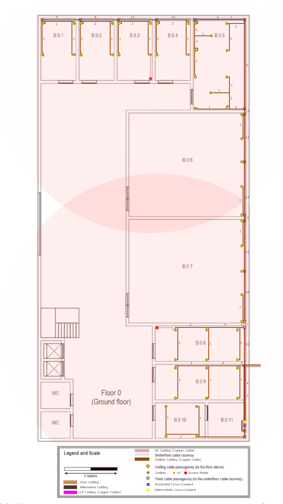
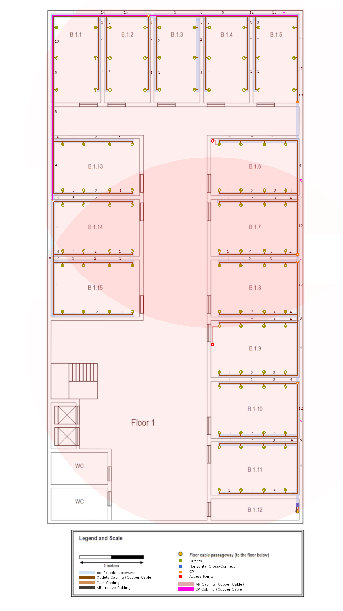

RCOMP 2022-2023 Project - Sprint 1 - Member 1211151 folder
===========================================

## BUILDING B ##

# Floor 0 #

## Floor 0 Representation ##

## Floor 0 Technical Info ##

| Room   | Width | Length |        Area        |
|--------|:-----:|:------:|:------------------:|
| B.0.1  | 3.3m  |  5.8m  | 19.1m2  |
| B.0.2  | 3.3m  |  5.8m  | 19.1m2  |
| B.0.3  | 3.3m  |  5.8m  | 19.1m2  |
| B.0.4  | 3.3m  |  5.8m  | 19.1m2  |
| B.0.5  |  5m   |  8.6m  |  43m2   |
| B.0.6  | 11.1m |  9.8m  | 108.8m2 |
| B.0.7  | 11.1m |  9.8m  | 108.8m2 |
| B.0.8  | 8.6m  |  3.3m  | 28.4m2  |
| B.0.9  | 8.6m  |  3.3m  | 28.4m2  |
| B.0.10 | 4.7m  |  3.3m  | 15.5m2  |
| B.0.11 | 3.6m  |  3.3m  | 11.9m2  |

### Floor 0 - Fiber Cables

* For the connection of Intermediate Cross-Connect(IC) to Horizontal Cross-Connect(HC) we choose Monomode optical fibre
  because it´s immune/less susceptible to dispersion and thus allows higher data rates.   

### Floor 0 - Cooper Cables

* To connect the Horizontal Cross-Connect(HC) to all Outlets we use Copper Cables CAT7.    
* We chose this cable type they can support faster data transfer rates (10 Gbps) and more simultaneous connections, which
  is important for modern applications.   
* Copper Cables CAT7 are generally more cost-effective than fiber optic cables.   
* Copper Cables CAT7 are compatible with a wide range of network devices.(end-user equipment is not usually prepared for fiber optic cables)   

### Floor 0 - Outlet

* The number of outlets we can place in a room was calculated using the areas previously mentioned.   
* The structured cabling standards say that for each 10m2, we should have at least 2 outlets.  
* There was some care to avoid placing equipment too close to doors to avoid damage.  
* Some areas have more than 2 outlets per 10m2 to provide flexibility for user, for this to happen we make sure that outlets always be
  less than 3m away from others outlets. 

### Floor 0 - Consolidation Point

* For this floor there will be 3 Consolidation Point.  
* 1st on Room B.0.8 that will host outlets of rooms -> B.0.8 to B.0.10
* 2nd on Room B.0.7 that will host outlets of rooms -> B.0.5 to B.0.7
* 3rd on Room B.0.4 that will host outlets of rooms -> B.0.1 to B.0.4
* This Consolidation are placed in this local's because this floor will have 52 Outlets, so using this Consolidation Points
  we can avoid to use a Patch Panel of 48 female connectors and can have a better organization on our structured cabling.

### Floor 0 - Access Point

* We choose to place 2 Access Point on the walls of rooms B.0.8 and B.0.3  
* Usually an Access Point will grant approximate a 50 meters diameter circle of coverage, but this is relative to an empty area.
  But in a Building like our we have walls that will interfere. So we only are considering a coverage of 30 meters.  
* We choose to place this Access Point on this local because it's near of all rooms and have less interference from walls
  than if it was placed inside a room.  

### Floor 0 - Intermediate Cross Connect
* The Intermediate cross-connect (IC) was placed in the room B.0.11 because this room it's a storage room and also contains the passageway to the floor above
  and provides easy access to the other rooms on that floor.  

### Floor 0 - Horizontal Cross Connect

* The Horizontal cross-connect (HC) was placed in the room B.0.11 to be closer to the IC and provides easy access to the other rooms on that floor.

## Floor 0 Inventory ##

#### Floor 0 Inventory - Fiber Cables ####
| Designation                                                 | Quantity |
|-------------------------------------------------------------|:--------:|
| Main Monomode optical fibre cable (Outside to IC )          |   5.5m   |
| Main Monomode optical fibre cable (IC to HC Floor 0)        |   0.5m   |
| Main Monomode optical fibre cable (IC to HC Floor 1)        |   5.5m   |
| Alternative Monomode optical fibre cable (Outside to IC )   |   5.5m   |
| Alternative Monomode optical fibre cable (IC to HC Floor 0) |   0.5m   |
| Alternative Monomode optical fibre cable (IC to HC Floor 1) |   5.5m   |
| Sum Monomode optical fibre cable:                           |   23m    |
| Total Monomode optical fibre cable:                         |   46m    |

* The presented value for Monomode optical fibre cable length present a margin of error.
* All Monomode optical fibre cable are included in this inventory
* The presented on "Total Monomode optical fibre cable" is the value presented on "Sum Monomode optical fibre cable"
multiplied by 2 because each path have 2 cables.

#### Floor 0 Inventory - Copper Cables ####
| Designation                                        | Quantity |
|----------------------------------------------------|:--------:|
| Copper Cables CAT7 (CP1 to Room B.0.10 - Outlet 1) |   23m    |
| Copper Cables CAT7 (CP1 to Room B.0.10 - Outlet 2) |   20m    |
| Copper Cables CAT7 (CP1 to Room B.0.10 - Outlet 3) |   20m    |
| Copper Cables CAT7 (CP1 to Room B.0.10 - Outlet 4) |   17m    |
| Copper Cables CAT7 (CP1 to Room B.0.9 - Outlet 5)  |   12m    |
| Copper Cables CAT7 (CP1 to Room B.0.9 - Outlet 6)  |   15m    |
| Copper Cables CAT7 (CP1 to Room B.0.9 - Outlet 7)  |   12m    |
| Copper Cables CAT7 (CP1 to Room B.0.9 - Outlet 8)  |    9m    |
| Copper Cables CAT7 (CP1 to Room B.0.9 - Outlet 9)  |    6m    |
| Copper Cables CAT7 (CP1 to Room B.0.9 - Outlet 10) |    9m    |
| Copper Cables CAT7 (CP1 to Room B.0.8 - Outlet 11) |    8m    |
| Copper Cables CAT7 (CP1 to Room B.0.8 - Outlet 12) |   11m    |
| Copper Cables CAT7 (CP1 to Room B.0.8 - Outlet 13) |    8m    |
| Copper Cables CAT7 (CP1 to Room B.0.8 - Outlet 14) |    5m    |
| Copper Cables CAT7 (CP1 to Room B.0.8 - Outlet 15) |    2m    |
| Copper Cables CAT7 (CP1 to Room B.0.8 - Outlet 16) |    5m    |
| Copper Cables CAT7 (CP2 to Room B.0.5 - Outlet 1)  |   40m    |
| Copper Cables CAT7 (CP2 to Room B.0.5 - Outlet 2)  |   38m    |
| Copper Cables CAT7 (CP2 to Room B.0.5 - Outlet 3)  |   38m    |
| Copper Cables CAT7 (CP2 to Room B.0.5 - Outlet 4)  |   35m    |
| Copper Cables CAT7 (CP2 to Room B.0.5 - Outlet 5)  |   30m    |
| Copper Cables CAT7 (CP2 to Room B.0.5 - Outlet 6)  |   34m    |
| Copper Cables CAT7 (CP2 to Room B.0.5 - Outlet 7)  |   26m    |
| Copper Cables CAT7 (CP2 to Room B.0.5 - Outlet 8)  |   27m    |
| Copper Cables CAT7 (CP2 to Room B.0.5 - Outlet 9)  |   27m    |
| Copper Cables CAT7 (CP2 to Room B.0.5 - Outlet 10) |   23m    |
| Copper Cables CAT7 (CP2 to Room B.0.6 - Outlet 11) |   21m    |
| Copper Cables CAT7 (CP2 to Room B.0.6 - Outlet 12) |   24m    |
| Copper Cables CAT7 (CP2 to Room B.0.6 - Outlet 13) |   17m    |
| Copper Cables CAT7 (CP2 to Room B.0.6 - Outlet 14) |   14m    |
| Copper Cables CAT7 (CP2 to Room B.0.6 - Outlet 15) |   12m    |
| Copper Cables CAT7 (CP2 to Room B.0.7 - Outlet 16) |   11m    |
| Copper Cables CAT7 (CP2 to Room B.0.7 - Outlet 17) |   13m    |
| Copper Cables CAT7 (CP2 to Room B.0.7 - Outlet 18) |    6m    |
| Copper Cables CAT7 (CP2 to Room B.0.7 - Outlet 19) |    4m    |
| Copper Cables CAT7 (CP2 to Room B.0.7 - Outlet 20) |    2m    |
| Copper Cables CAT7 (CP3 to Room B.0.1 - Outlet 1)  |   19m    |
| Copper Cables CAT7 (CP3 to Room B.0.1 - Outlet 2)  |   16m    |
| Copper Cables CAT7 (CP3 to Room B.0.1 - Outlet 3)  |   19m    |
| Copper Cables CAT7 (CP3 to Room B.0.1 - Outlet 4)  |   22m    |
| Copper Cables CAT7 (CP3 to Room B.0.2 - Outlet 5)  |   15m    |
| Copper Cables CAT7 (CP3 to Room B.0.2 - Outlet 6)  |   12m    |
| Copper Cables CAT7 (CP3 to Room B.0.2 - Outlet 7)  |   15m    |
| Copper Cables CAT7 (CP3 to Room B.0.2 - Outlet 8)  |   18m    |
| Copper Cables CAT7 (CP3 to Room B.0.3 - Outlet 9)  |   12m    |
| Copper Cables CAT7 (CP3 to Room B.0.3 - Outlet 10) |    8m    |
| Copper Cables CAT7 (CP3 to Room B.0.3 - Outlet 11) |   11m    |
| Copper Cables CAT7 (CP3 to Room B.0.3 - Outlet 12) |   15m    |
| Copper Cables CAT7 (CP3 to Room B.0.4 - Outlet 13) |    8m    |
| Copper Cables CAT7 (CP3 to Room B.0.4 - Outlet 14) |    5m    |
| Copper Cables CAT7 (CP3 to Room B.0.4 - Outlet 15) |    2m    |
| Copper Cables CAT7 (CP3 to Room B.0.4 - Outlet 16) |    5m    |
| Copper Cables CAT7 (HC to Room B.0.8 - CP1)        |   12m    |
| Copper Cables CAT7 (HC to Room B.0.7 - CP2)        |   12m    |
| Copper Cables CAT7 (HC to Room B.0.4 - CP3)        |   46m    |
| Copper Cables CAT7 (CP1 to Room B.0.7 - CP2)       |    3m    |
| Copper Cables CAT7 (CP1 to Room B.0.4 - CP3)       |   37m    |
| Copper Cables CAT7 (CP2 to Room B.0.4 - CP3)       |   37m    |
| Copper Cables CAT7 (Outlet 11 (CP1) - AP1)         |    3m    |
| Copper Cables CAT7 (Outlet 12 (CP3) - AP2)         |    4m    |
| Total Copper Cables CAT7 :                         |   979m   |

* The presented value for copper cable length presents a margin of error (~1m).
* The CPs are positioned 1m above the ground, on the wall. These are not only connected with the HC but also with each other to give some redundancy.
* The HC is positioned 1m above the ground, on the wall.
* The APs are positioned 1m above the ground.
* The Outlets are positioned on the ground to make a more efficient use of the copper cables.

#### Floor 0 Inventory - Others ####
| Designation                    | Quantity |
|--------------------------------|:--------:|
| Network Outlets                |    52    |
| Outlets Cabling (Copper Cable) |    52    |
| Cat7 Patch Cords  (Outlets)    |    52    |
| Switch 24port                  |    3     |
| Copper Patch Panels (24 ports) |    3     |
| CP Cabling (Copper Cable)      |    6     |
| Cat7 Patch Cords  (CPs)        |    12    |
| Router Access Point            |    2     |
| AP Cabling (Copper Cable)      |    2     |
| Cat7 Patch Cords  (APs)        |    4     |
| Horizontal Cross-Connect       |    1     |
| Intermediate Cross-Connect     |    1     |
| Fiber Patch Panel 24port       |    1     |
| Fiber Patch Cords              |    4     |
| Main Cabling                   |    6     |
| Alternative Cabling            |    6     |
| Rack 6U                        |    2     |
| Rack 3U                        |    3     |
| Cable protection gutter        |   116m   |

# Floor 1 #

## Floor 1 Representation ##

* The path "Roof passageway" is represented on this image to have a better organization of the structured cabling through the ceiling

## Floor 1 Technical Info ##

| Room   | Width | Length |       Area        |
|--------|:-----:|:------:|:-----------------:|
| B.1.1  | 3.8m  |   7m   | 26.6m2 |
| B.1.2  | 3.5m  |   7m   | 24.5m2 |
| B.1.3  | 3.5m  |   7m   | 24.5m2 |
| B.1.4  | 3.5m  |   7m   | 24.5m2 |
| B.1.5  | 3.5m  |   7m   | 24.5m2 |
| B.1.6  |  7m   |  4.5m  | 31.5m2 |
| B.1.7  |  7m   |  4.5m  | 31.5m2 |
| B.1.8  |  7m   |  4.5m  | 31.5m2 |
| B.1.9  |  7m   |  4.5m  | 31.5m2 |
| B.1.10 |  7m   |  4.5m  | 31.5m2 |
| B.1.11 |  7m   |  4.3m  | 30.1m2 |
| B.1.12 |  7m   |  1.7m  | 11.9m2 |
| B.1.13 |  7m   |  4.5m  | 31.5m2 |
| B.1.14 |  7m   |  4.5m  | 31.5m2 |
| B.1.15 |  7m   |  4.5m  | 31.5m2 |

### Floor 1 - Fiber Cables

* For the connection of Intermediate Cross-Connect(IC) to Horizontal Cross-Connect(HC) we choose Monomode optical fibre
  because it´s immune/less susceptible to dispersion and thus allows higher data rates.   

### Floor 1 - Cooper Cables

* To connect the Horizontal Cross-Connect(HC) to all Outlets we use Copper Cables CAT7.    
* We chose this cable type they can support faster data transfer rates (10 Gbps) and more simultaneous connections, which
  is important for modern applications.   
* Copper Cables CAT7 are generally more cost-effective than fiber optic cables.   
* Copper Cables CAT7 are compatible with a wide range of network devices.(end-user equipment is not usually prepared for fiber optic cables)   

### Floor 1 - Outlet

* The number of outlets we can place in a room was calculated using the areas previously mentioned.   
* The structured cabling standards say that for each 10m2, we should have at least 2 outlets.  
* There was some care to avoid placing equipment too close to doors to avoid damage.  
* Some areas have more than 2 outlets per 10m2 to provide flexibility for user, for this to happen we make sure that outlets always be
  less than 3m away from others outlets. 
* For the rooms where the Access Points are located, the specific outlet that connects to the AP is located on the ceiling instead of the walls to allow for a more direct connection.

### Floor 1 - Consolidation Point

* For this floor there will be 6 Consolidation Point.  
* 1st on Room B.1.10 that will host outlets of rooms -> B.1.10 to B.1.11
* 2nd on Room B.1.8 that will host outlets of rooms -> B.1.8 to B.1.9
* 3rd on Room B.1.7 that will host outlets of rooms -> B.1.6 to B.1.7
* 4th on Room B.1.5 that will host outlets of rooms -> B.1.3 to B.1.5
* 5th on Room B.1.2 that will host outlets of rooms -> B.1.1 to B.1.2 and B.1.13
* 6th on Room B.1.14 that will host outlets of rooms -> B.1.14 to B.1.15
* This Consolidation are placed in this local's because this floor will have 102 Outlets, so using this Consolidation Points
  we can avoid to use a Patch Panel of 48 female connectors and can have a better organization on our structured cabling.

### Floor 1 - Access Point

* We choose to place 2 Access Point on the ceilings of rooms B.1.6 and B.1.9  
* Usually an Access Point will grant approximate a 50 meters diameter circle of coverage, but this is relative to an empty area.
  But in a Building like our we have walls that will interfere. So we only are considering a coverage of 30 meters.  
* We choose to place this Access Point on this local because it's near of all rooms and have less interference from walls
  than if it was placed inside a room.  

### Floor 1 - Horizontal Cross Connect

* The Horizontal cross-connect (HC) was placed in the room B.1.12 because this room it's a storage room and also contains the passageway to the floor above
  and provides easy access to the other rooms on that floor.  

## Floor 1 Inventory ##

#### Floor 1 Inventory - Copper Cables ####
| Designation                                         | Quantity |
|-----------------------------------------------------|:--------:|
| Copper Cables CAT7 (CP1 to Room B.1.11 - Outlet 1)  |   19m    |
| Copper Cables CAT7 (CP1 to Room B.1.11 - Outlet 2)  |   17m    |
| Copper Cables CAT7 (CP1 to Room B.1.11 - Outlet 3)  |   15m    |
| Copper Cables CAT7 (CP1 to Room B.1.11 - Outlet 4)  |   13m    |
| Copper Cables CAT7 (CP1 to Room B.1.11 - Outlet 5)  |   15m    |
| Copper Cables CAT7 (CP1 to Room B.1.11 - Outlet 6)  |   13m    |
| Copper Cables CAT7 (CP1 to Room B.1.11 - Outlet 7)  |   11m    |
| Copper Cables CAT7 (CP1 to Room B.1.11 - Outlet 8)  |    9m    |
| Copper Cables CAT7 (CP1 to Room B.1.10 - Outlet 9)  |   15m    |
| Copper Cables CAT7 (CP1 to Room B.1.10 - Outlet 10) |   13m    |
| Copper Cables CAT7 (CP1 to Room B.1.10 - Outlet 11) |   11m    |
| Copper Cables CAT7 (CP1 to Room B.1.10 - Outlet 12) |    9m    |
| Copper Cables CAT7 (CP1 to Room B.1.10 - Outlet 13) |   10m    |
| Copper Cables CAT7 (CP1 to Room B.1.10 - Outlet 14) |    8m    |
| Copper Cables CAT7 (CP1 to Room B.1.10 - Outlet 15) |    6m    |
| Copper Cables CAT7 (CP1 to Room B.1.10 - Outlet 16) |    4m    |
| Copper Cables CAT7 (CP2 to Room B.1.9 - Outlet 1)   |   19m    |
| Copper Cables CAT7 (CP2 to Room B.1.9 - Outlet 2)   |   17m    |
| Copper Cables CAT7 (CP2 to Room B.1.9 - Outlet 3)   |   15m    |
| Copper Cables CAT7 (CP2 to Room B.1.9 - Outlet 4)   |   13m    |
| Copper Cables CAT7 (CP2 to Room B.1.9 - Outlet 5)   |   13m    |
| Copper Cables CAT7 (CP2 to Room B.1.9 - Outlet 6)   |   13m    |
| Copper Cables CAT7 (CP2 to Room B.1.9 - Outlet 7)   |   11m    |
| Copper Cables CAT7 (CP2 to Room B.1.9 - Outlet 8)   |    9m    |
| Copper Cables CAT7 (CP2 to Room B.1.8 - Outlet 9)   |   15m    |
| Copper Cables CAT7 (CP2 to Room B.1.8 - Outlet 10)  |   13m    |
| Copper Cables CAT7 (CP2 to Room B.1.8 - Outlet 11)  |   11m    |
| Copper Cables CAT7 (CP2 to Room B.1.8 - Outlet 12)  |    9m    |
| Copper Cables CAT7 (CP2 to Room B.1.8 - Outlet 13)  |   10m    |
| Copper Cables CAT7 (CP2 to Room B.1.8 - Outlet 14)  |    8m    |
| Copper Cables CAT7 (CP2 to Room B.1.8 - Outlet 15)  |    6m    |
| Copper Cables CAT7 (CP2 to Room B.1.8 - Outlet 16)  |    4m    |
| Copper Cables CAT7 (CP3 to Room B.1.7 - Outlet 1)   |   10m    |
| Copper Cables CAT7 (CP3 to Room B.1.7 - Outlet 2)   |    8m    |
| Copper Cables CAT7 (CP3 to Room B.1.7 - Outlet 3)   |    6m    |
| Copper Cables CAT7 (CP3 to Room B.1.7 - Outlet 4)   |    4m    |
| Copper Cables CAT7 (CP3 to Room B.1.7 - Outlet 5)   |   15m    |
| Copper Cables CAT7 (CP3 to Room B.1.7 - Outlet 6)   |   13m    |
| Copper Cables CAT7 (CP3 to Room B.1.7 - Outlet 7)   |   11m    |
| Copper Cables CAT7 (CP3 to Room B.1.7 - Outlet 8)   |    9m    |
| Copper Cables CAT7 (CP3 to Room B.1.6 - Outlet 9)   |   15m    |
| Copper Cables CAT7 (CP3 to Room B.1.6 - Outlet 10)  |   13m    |
| Copper Cables CAT7 (CP3 to Room B.1.6 - Outlet 11)  |   11m    |
| Copper Cables CAT7 (CP3 to Room B.1.6 - Outlet 12)  |    9m    |
| Copper Cables CAT7 (CP3 to Room B.1.6 - Outlet 13)  |   17m    |
| Copper Cables CAT7 (CP3 to Room B.1.6 - Outlet 14)  |   17m    |
| Copper Cables CAT7 (CP3 to Room B.1.6 - Outlet 15)  |   15m    |
| Copper Cables CAT7 (CP3 to Room B.1.6 - Outlet 16)  |   13m    |
| Copper Cables CAT7 (CP4 to Room B.1.3 - Outlet 1)   |   27m    |
| Copper Cables CAT7 (CP4 to Room B.1.3 - Outlet 2)   |   25m    |
| Copper Cables CAT7 (CP4 to Room B.1.3 - Outlet 3)   |   22m    |
| Copper Cables CAT7 (CP4 to Room B.1.3 - Outlet 4)   |   19m    |
| Copper Cables CAT7 (CP4 to Room B.1.3 - Outlet 5)   |   22m    |
| Copper Cables CAT7 (CP4 to Room B.1.3 - Outlet 6)   |   24m    |
| Copper Cables CAT7 (CP4 to Room B.1.4 - Outlet 7)   |   23m    |
| Copper Cables CAT7 (CP4 to Room B.1.4 - Outlet 8)   |   21m    |
| Copper Cables CAT7 (CP4 to Room B.1.4 - Outlet 9)   |   18m    |
| Copper Cables CAT7 (CP4 to Room B.1.4 - Outlet 10)  |   15m    |
| Copper Cables CAT7 (CP4 to Room B.1.4 - Outlet 11)  |   18m    |
| Copper Cables CAT7 (CP4 to Room B.1.4 - Outlet 12)  |   20m    |
| Copper Cables CAT7 (CP4 to Room B.1.5 - Outlet 13)  |   19m    |
| Copper Cables CAT7 (CP4 to Room B.1.5 - Outlet 14)  |   17m    |
| Copper Cables CAT7 (CP4 to Room B.1.5 - Outlet 15)  |   14m    |
| Copper Cables CAT7 (CP4 to Room B.1.5 - Outlet 16)  |    9m    |
| Copper Cables CAT7 (CP4 to Room B.1.5 - Outlet 17)  |    7m    |
| Copper Cables CAT7 (CP4 to Room B.1.5 - Outlet 18)  |    4m    |
| Copper Cables CAT7 (CP5 to Room B.1.13 - Outlet 1)  |   26m    |
| Copper Cables CAT7 (CP5 to Room B.1.13 - Outlet 2)  |   27m    |
| Copper Cables CAT7 (CP5 to Room B.1.13 - Outlet 3)  |   29m    |
| Copper Cables CAT7 (CP5 to Room B.1.13 - Outlet 4)  |   31m    |
| Copper Cables CAT7 (CP5 to Room B.1.13 - Outlet 5)  |   22m    |
| Copper Cables CAT7 (CP5 to Room B.1.13 - Outlet 6)  |   23m    |
| Copper Cables CAT7 (CP5 to Room B.1.13 - Outlet 7)  |   25m    |
| Copper Cables CAT7 (CP5 to Room B.1.13 - Outlet 8)  |   27m    |
| Copper Cables CAT7 (CP5 to Room B.1.1 - Outlet 9)   |   17m    |
| Copper Cables CAT7 (CP5 to Room B.1.1 - Outlet 10)  |   15m    |
| Copper Cables CAT7 (CP5 to Room B.1.1 - Outlet 11)  |   12m    |
| Copper Cables CAT7 (CP5 to Room B.1.1 - Outlet 12)  |    8m    |
| Copper Cables CAT7 (CP5 to Room B.1.1 - Outlet 13)  |   11m    |
| Copper Cables CAT7 (CP5 to Room B.1.1 - Outlet 14)  |   13m    |
| Copper Cables CAT7 (CP5 to Room B.1.2 - Outlet 15)  |   12m    |
| Copper Cables CAT7 (CP5 to Room B.1.2 - Outlet 16)  |   10m    |
| Copper Cables CAT7 (CP5 to Room B.1.2 - Outlet 17)  |    7m    |
| Copper Cables CAT7 (CP5 to Room B.1.2 - Outlet 18)  |    4m    |
| Copper Cables CAT7 (CP5 to Room B.1.2 - Outlet 19)  |    7m    |
| Copper Cables CAT7 (CP5 to Room B.1.2 - Outlet 20)  |    9m    |
| Copper Cables CAT7 (CP6 to Room B.1.15 - Outlet 1)  |   13m    |
| Copper Cables CAT7 (CP6 to Room B.1.15 - Outlet 2)  |   15m    |
| Copper Cables CAT7 (CP6 to Room B.1.15 - Outlet 3)  |   17m    |
| Copper Cables CAT7 (CP6 to Room B.1.15 - Outlet 4)  |   19m    |
| Copper Cables CAT7 (CP6 to Room B.1.15 - Outlet 5)  |    9m    |
| Copper Cables CAT7 (CP6 to Room B.1.15 - Outlet 6)  |   11m    |
| Copper Cables CAT7 (CP6 to Room B.1.15 - Outlet 7)  |   13m    |
| Copper Cables CAT7 (CP6 to Room B.1.15 - Outlet 8)  |   15m    |
| Copper Cables CAT7 (CP6 to Room B.1.16 - Outlet 9)  |    9m    |
| Copper Cables CAT7 (CP6 to Room B.1.16 - Outlet 10) |   11m    |
| Copper Cables CAT7 (CP6 to Room B.1.16 - Outlet 11) |   13m    |
| Copper Cables CAT7 (CP6 to Room B.1.16 - Outlet 12) |   15m    |
| Copper Cables CAT7 (CP6 to Room B.1.16 - Outlet 13) |    4m    |
| Copper Cables CAT7 (CP6 to Room B.1.16 - Outlet 14) |    6m    |
| Copper Cables CAT7 (CP6 to Room B.1.16 - Outlet 15) |    8m    |
| Copper Cables CAT7 (CP6 to Room B.1.16 - Outlet 16) |   10m    |
| Copper Cables CAT7 (HC to Room B.1.10 - CP1)        |   13m    |
| Copper Cables CAT7 (HC to Room B.1.8 - CP2)         |   22m    |
| Copper Cables CAT7 (HC to Room B.1.7 - CP3)         |   23m    |
| Copper Cables CAT7 (HC to Room B.1.5 - CP4)         |   35m    |
| Copper Cables CAT7 (HC to Room B.1.2 - CP5)         |   54m    |
| Copper Cables CAT7 (HC to Room B.1.14 - CP6)        |   76m    |
| Copper Cables CAT7 (CP1 to Room B.1.7 - CP3)        |   14m    |
| Copper Cables CAT7 (CP3 to Room B.1.2 - CP5)        |   34m    |
| Copper Cables CAT7 (CP2 to Room B.1.5 - CP4)        |   16m    |
| Copper Cables CAT7 (CP4 to Room B.1.14 - CP6)       |   44m    |
| Copper Cables CAT7 (Outlet 13 (CP3) - AP1)          |    1m    |
| Copper Cables CAT7 (Outlet 5 (CP2) - AP2)           |    2m    |
| Total Copper Cables CAT7 :                          |  1515m   |

* The presented value for copper cable length presents a margin of error (~1m).
* The CPs are positioned 1.5m above the ground, on the wall. These are not only connected with the HC but also with each other in order to give some redundancy.
* The HC is positioned 1.5m above the ground, on the wall.
* The APs are positioned on the roof.
* The Outlets are positioned 0.5m above the ground, on the wall (except the ones that are connected to the APs, those are connected to the ceiling) to make a more efficient use of the copper cables.

#### Floor 1 Inventory - Others ####
| Designation                    | Quantity |
|--------------------------------|:--------:|
| Network Outlets                |   102    |
| Outlets Cabling (Copper Cable) |   102    |
| Cat7 Patch Cords  (Outlets)    |   102    |
| Switch 24port                  |    6     |
| Copper Patch Panels (24 ports) |    6     |
| CP Cabling (Copper Cable)      |    10    |
| Cat7 Patch Cords  (CPs)        |    20    |
| Router Access Point            |    2     |
| AP Cabling (Copper Cable)      |    2     |
| Cat7 Patch Cords  (APs)        |    4     |
| Horizontal Cross-Connect       |    1     |
| Rack 6U                        |    1     |
| Rack 3U                        |    6     |
| Cable protection gutter        |   212m   |

* Monomode optical fibre cable are included in the inventory of Floor 0.