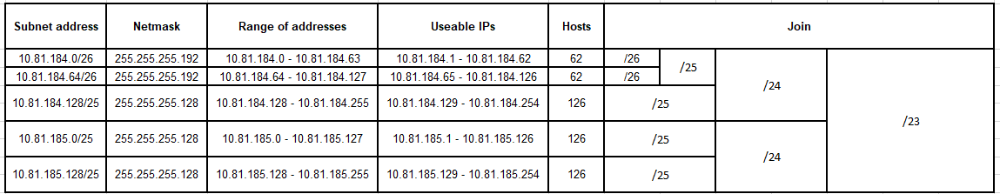

RCOMP 2022-2023 Project - Sprint 2 Member 1211131 folder
===========================================

## Building A and Backbone nodes required

| Network                                                                        | Required Nodes |
|:-------------------------------------------------------------------------------|:--------------:|
| End user outlets on the ground floor                                           |       40       |
| End user outlets on floor one                                                  |       70       |
| Wi-Fi network                                                                  |      100       |
| DMZ (Servers, administration workstations, and network infrastructure devices) |       90       |
| VoIP (IP-phones):                                                              |       35       |
| Backbone                                                                       |      100       |
| Total:                                                                         |      435       |

---

## Devices naming

| Device                                             | Packet Tracer  - Host Name | Packet Tracer  - Display Name |
|:---------------------------------------------------|:---------------------------|:------------------------------|
| Building A Intermediate Cross-Connect              | Switch-PT-Empty            | BldgA_IC                      |
| Building B Intermediate Cross-Connect              | Switch-PT-Empty            | BldgB_IC                      |
| Building C Intermediate Cross-Connect              | Switch-PT-Empty            | BldgC_IC                      |
| Building D Intermediate Cross-Connect              | Switch-PT-Empty            | BldgD_IC                      |
| Building A Horizontal Cross-Connect Floor 0        | Switch-PT-Empty            | BldgA_Floor0_HC               |
| Building A Horizontal Cross-Connect Floor 1        | Switch-PT-Empty            | BldgA_Floor1_HC               |
| Consolidation Point of Room's(A.0.1, A.0.2, A.0.3) | Switch-PT-Empty            | BldgA_CP_Room A.0.3           |
| Consolidation Point of Room A.0.6                  | Switch-PT-Empty            | BldgA_CP_Room A.0.6           |
| Consolidation Point of Room's(A.1.1, A.1.2, A.1.3) | Switch-PT-Empty            | BldgA_CP_Room A.1.3           |
| Consolidation Point of Room A.1.4                  | Switch-PT-Empty            | BldgA_CP_Room A.1.4           |
| Consolidation Point of Room A.1.5                  | Switch-PT-Empty            | BldgA_CP_Room A.1.5           |
| Consolidation Point of Room A.1.6                  | Switch-PT-Empty            | BldgA_CP_Room A.1.6           |
| Consolidation Point of Room A.1.7                  | Switch-PT-Empty            | BldgA_CP_Room A.1.7           |
| PC of Room A.0.1                                   | PC-PT                      | BldgA_A.0.1                   |
| PC of Room A.0.2                                   | PC-PT                      | BldgA_A.0.2                   |
| PC of Room A.0.3                                   | PC-PT                      | BldgA_A.0.3                   |
| PC of Room A.0.4                                   | PC-PT                      | BldgA_A.0.4                   |
| PC of Room A.0.5                                   | PC-PT                      | BldgA_A.0.5                   |
| PC of Room A.0.6                                   | PC-PT                      | BldgA_A.0.6                   |
| PC of Room A.1.1                                   | PC-PT                      | BldgA_A.1.1                   |
| PC of Room A.1.2                                   | PC-PT                      | BldgA_A.1.2                   |
| PC of Room A.1.3                                   | PC-PT                      | BldgA_A.1.3                   |
| PC of Room A.1.4                                   | PC-PT                      | BldgA_A.1.4                   |
| PC of Room A.1.5                                   | PC-PT                      | BldgA_A.1.5                   |
| PC of Room A.1.6                                   | PC-PT                      | BldgA_A.1.6                   |
| PC of Room A.1.7                                   | PC-PT                      | BldgA_A.1.7                   |
| Access Point Floor 0                               | AccessPoint-PT             | BldgA_Floor0_AP               |
| Access Point Floor 1                               | AccessPoint-PT             | BldgA_Floor1_AP               |
| Laptop Floor 0                                     | Laptop-PT                  | BldgA_Floor0_Laptop           |
| Laptop Floor 1                                     | Laptop-PT                  | BldgA_Floor1_Laptop           |
| Building phone                                     | IP Phone - 7960            | BldgA_Phone                   |
| Building server                                    | Server-PT                  | BldgA_Server                  |
| Building A Router                                  | 2811                       | BldgA_Router                  |
| Building B Router                                  | 2811                       | BldgB_Router                  |
| Building C Router                                  | 2811                       | BldgC_Router                  |
| Building D Router                                  | 2811                       | BldgD_Router                  |
| Modem                                              | DSL-Modem-PT               | BldgA_DSL_Modem               |
|                                                    |                            |                               |

---

## Layer two configuration

### Virtual LANs
* All VLAN's presented on "The VLAN database" were added to BldgA_IC (Building A Intermediate Cross-Connect). 
Further, forward they will be added to other switches.

### Spanning tree protocol
* Not disable STP

### VLAN Trucking Protocol (VTP)
* In this point we need to ensure that all switches have the same complete VLAN database. 
* To do this we need to configure the VTP domain described on "VTP domain".
* The switch - BldgA_IC are set as vtp server.
* Other switches are set with client mode.
* Before we change the connections between switches to trunk mode to ensure that VLAN database established by the servers is propagated.

### The VLAN database

| VLAN Name        | VLAN ID |
|------------------|:-------:|
| Backbone         |   575   |
| BuildingA_Floor0 |   576   |
| BuildingA_Floor1 |   577   |
| BuildingA_WiFI   |   578   |
| BuildingA_DMZ    |   579   |
| BuildingA_VoIP   |   580   |
| BuildingB_Floor0 |   581   |
| BuildingB_Floor1 |   582   |
| BuildingB_WiFI   |   583   |
| BuildingB_DMZ    |   584   |
| BuildingB_VoIP   |   585   |
| BuildingC_Floor0 |   586   |
| BuildingC_Floor1 |   587   |
| BuildingC_WiFI   |   588   |
| BuildingC_DMZ    |   589   |
| BuildingC_VoIP   |   590   |
| BuildingD_Floor0 |   591   |
| BuildingD_Floor1 |   592   |
| BuildingD_WiFI   |   593   |
| BuildingD_DMZ    |   594   |
| BuildingD_VoIP   |   595   |

### VTP domain
* VTP domain to be used : **rc23dj3**
---

## Layer three configuration

### IPv4 networks

| VLAN NAME        | VLAN ID | Required Nodes |  Sub Network Address  |       MASK       |         Address Range         |          Usable IPs           |
|:-----------------|:-------:|:--------------:|:---------------------:|:----------------:|:-----------------------------:|:-----------------------------:|
| BuildingA_Floor0 |   576   |       40       |    10.81.184.0/26     | 255.255.255.192  |  10.81.184.0 - 10.81.184.63   |  10.81.184.1 - 10.81.184.62   |
| BuildingA_Floor1 |   577   |       70       |   10.81.184.128/25    | 255.255.255.128  | 10.81.184.128 - 10.81.184.255 | 10.81.184.129 - 10.81.184.254 |
| BuildingA_WiFI   |   578   |      100       |    10.81.185.0/25     | 255.255.255.128  |  10.81.185.0 - 10.81.185.127  |  10.81.185.1 - 10.81.185.126  |
| BuildingA_DMZ    |   579   |       90       |   10.81.185.128/25    | 255.255.255.128  | 10.81.185.128 - 10.81.185.255 | 10.81.185.129 - 10.81.185.254 |
| BuildingA_VoIP   |   580   |       35       |    10.81.184.64/26    | 255.255.255.192  | 10.81.184.64 - 10.81.184.127  | 10.81.184.65 - 10.81.184.126  |

For VLAN -> Backbone with ID -> 575 are required  100 nodes 
Sub Network Address for VLAN : 10.81.189.0/25
Address for this building : 10.81.189.1

### IPv4 networks - Document detailing
* Building A need's 335 nodes.
* So the IP address space for this building is : 10.81.184.0/23.
* 10.81.184.0/23 -> 510
* First network required 40 nodes (64)->10.81.184.0/26 
* Second network required 35 nodes (64)->10.81.184.64/26 
* Third network required 70 nodes (128)->10.81.184.128/25 
* Fourth network required 90 nodes (128)->10.81.185.0/25
* Fifth network required 100 nodes (128)->10.81.185.128/25

### Routers and static routing

|   NETWORK   |      MASK      |  NEXT-HOP   |
|:-----------:|:--------------:|:-----------:|
| 10.81.186.0 | 255.255.255.0	 | 10.81.189.2 |
| 10.81.187.0 | 255.255.255.0	 | 10.81.189.3 |
| 10.81.188.0 | 255.255.255.0	 | 10.81.189.4 |

### Routers and static routing - Document detailing

##### Building B 
NETWORK: 10.81.186.0  
MASK: 255.255.255.0 
NEXT-HOP: 10.81.189.2  

The Building B entry indicates that any traffic destined for the network 10.81.186.0 (Building B IP address space) with a 
subnet mask of 255.255.255.0 should be forwarded to the next-hop IP address 10.81.189.2(Building B backbone IP).
##### Building C
NETWORK: 10.81.187.0 
MASK: 255.255.255.0 
NEXT-HOP: 10.81.189.3  

The Building C entry indicates that any traffic destined for the network 10.81.187.0 (Building C IP address space) with a
subnet mask of 255.255.255.0 should be forwarded to the next-hop IP address 10.81.189.3(Building C backbone IP).
##### Building D
NETWORK: 10.81.188.0 
MASK: 255.255.255.0 
NEXT-HOP: 10.81.189.4  

The Building D entry indicates that any traffic destined for the network 10.81.188.0 (Building D IP address space) with a
subnet mask of 255.255.255.0 should be forwarded to the next-hop IP address 10.81.189.4(Building D backbone IP).

### Internet connection
* To get an internet connection we add  an DSL modem connected to Building A router.
* The IPv4 node address to this router is 121.60.203.74/30.

---